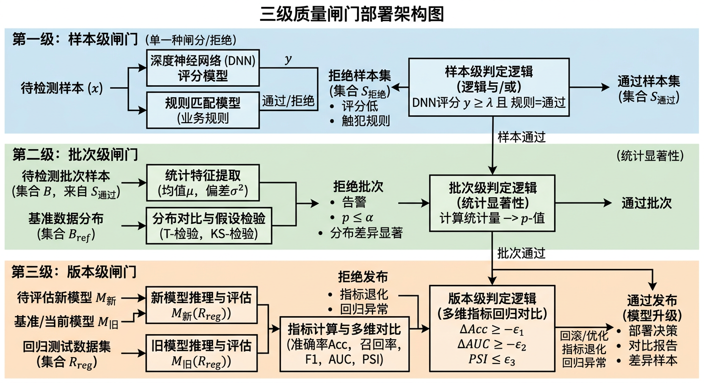

## 交底书名称

一种无真值标注条件下的蒙皮质量自动评估、异常筛选与数据闭环构建方法、系统及存储介质

---

## 缩略语和关键术语定义

- **GT（Ground Truth，真值标注）**：监督训练或质量评估中所用的标准答案数据，通常由人工标注产生。
- **无GT评估（GT-Free Evaluation）**：缺少人工真值标注时，仅依赖规则、约束或统计模型对质量进行自动判断的方法体系。
- **蒙皮结果（Skinning Output）**：由骨骼变换和顶点权重驱动得到的网格顶点序列或单帧形变结果。
- **指标插件（Metric Plugin）**：可插拔的质量计算单元，接受蒙皮数据输入，输出单项质量分数和定位信息，支持按项目启停与权重配置。
- **异常样本（Anomalous Sample）**：在穿插、粘连、共线、能量突变、边界抖动等一项或多项指标上超过阈值的蒙皮结果。
- **质量闸门（Quality Gate）**：在资产入库、训练数据入集或模型发布前执行的自动拦截与分级处理机制。
- **数据闭环（Data Loop）**：由评估、筛选、清洗、再训练、回归验证组成的自动循环流程。
- **难例挖掘（Hard Example Mining）**：从高频或高严重度异常样本中优先抽取高价值样本，用于定向微调。
- **连通域定位（Connected Component Localization）**：将超阈值异常顶点或面片在拓扑上聚类为连续区域，输出区域级定位结果。
- **版本回归（Version Regression）**：对比模型新旧版本或规则新旧配置下关键指标分布，用于发现质量退化并阻断风险发布。
- **自适应阈值（Adaptive Threshold）**：根据样本分布或部位差异动态调整的异常判定阈值，跨角色迁移性优于固定阈值。
- **聚合策略（Aggregation Strategy）**：将多项指标分数整合为总分的方法，包括加权求和、规则树门控、投票机制等。

---

## 1、*本发明的技术关键点（欲保护点）

本发明面向三维角色动画生产中的蒙皮质量治理问题，提出一种"无GT物理规则自动评估 + 数据闭环构建"的平台化技术方案。该方案的核心不是某单一检测指标，而是"多指标评估引擎、异常定位与分类、自动清洗重加权、训练联动回归"四层闭环协同体系，在无需人工标注的前提下，实现蒙皮质量的自动化管控与持续改进。

本发明欲保护的技术关键点包括以下六个协同层次：

**关键点一：无GT多指标评估框架**
在无人工标注前提下，从几何（共线、形变）、拓扑（穿插、粘连）、运动学（速度连续性）和能量一致性（局部应变、边界抖动）多个维度构建可计算指标体系，对蒙皮结果进行多维度自动质量评分。各指标基于物理/几何规则推导，具备明确的数学定义与工程可实施性。

**关键点二：插件化指标架构**
将各类指标设计为独立计算插件，插件间无强依赖，支持按项目需求启停、调整计算顺序、配置权重与版本，并允许新增指标而不影响已有流程稳定性。该架构使评估体系具备持续扩展能力。

**关键点三：自适应阈值与多策略聚合**
阈值策略支持固定阈值、分位数阈值和按部位自适应阈值三种模式，使阈值能够随数据分布自动适配不同角色类型、服装类别和动作范围。多指标聚合采用加权求和与门控惩罚相结合的机制，关键指标超强阈值时触发额外惩罚，防止总分掩盖局部严重异常。

**关键点四：异常定位与可解释报告**
评估结果支持从样本级分数下钻至顶点/边/面/骨骼影响域的细粒度定位，通过连通域聚类输出区域级定位结果，同时生成异常类型、严重度、触发规则路径和建议处理动作的可解释报告，便于美术和工程快速复查与定向修复。

**关键点五：数据闭环联动执行**
按异常评级自动执行样本路由（保留/剔除/降权/重采样）与训练联动（难例入库、定向微调触发、损失调制），将质量评估结果直接转化为训练数据优化动作，形成评估—训练—评估的持续改进闭环。

**关键点六：质量闸门化部署与版本回归**
将评估机制部署为三类标准闸门（资产入库闸门、训练数据闸门、模型发布闸门），并通过版本回归机制持续监控关键指标趋势，一旦新版本指标退化超过阈值，自动阻断发布或触发回滚，实现对生产质量的系统性保障。

本发明强调"无GT场景也能稳定评估并持续改进"，将质量治理从"人工经验化"升级为"可执行、可追溯、可扩展"的工程系统。

---

## 2、*与本发明最相近的现有技术

现有技术中，与本发明最接近的方案主要包括：人工质检流程、单指标规则筛查、以及依赖GT的监督式评分模型。上述方案在单一环节有一定效果，但在无GT条件下难以形成稳定闭环。

### 2.1 现有技术的技术方案

**方案一：人工逐条审核方案**
由动画师或技术美术逐帧检查蒙皮结果，发现异常后手动标注或剔除。该方法在准确度上可接受，但人力成本高，主观性强，批量场景下吞吐量极低。

**方案二：单指标硬阈值方案**
仅使用单一指标（如穿插深度或法线翻折比例）执行布尔判断，超阈值即报异常。实现简单，但漏检和误检率高，无法覆盖复合异常类型，且阈值跨项目迁移性差。

**方案三：监督学习评分方案**
利用人工标注数据训练质量分类或回归模型，实现自动打分。构建成本高，且跨角色类型、跨服装、跨动作的泛化风险较大，GT采集难以规模化。

**方案四：离线一次性清洗方案**
对已有样本执行一次性异常筛除，但清洗结果不与后续训练、版本回归形成联动，缺乏持续改进机制。

**方案五：静态统一阈值方案**
在所有部位和角色类型上复用同一阈值集合，容易导致头发、布料、躯干等不同部位的评价系统性偏差。

### 2.2 现有技术缺点及本发明解决的问题

**缺陷一：无GT场景下难以评估**
缺少真值导致监督式方案无法落地。本发明通过可解释的物理规则和几何约束替代GT依赖，构建无标注场景下的稳定质量评分体系。

**缺陷二：单指标覆盖不足**
单指标方案无法识别复合异常（如同时存在轻微穿插与粘连的样本）。本发明采用多指标并行计算与门控聚合机制，显著提升异常类型覆盖率和评估稳健性。

**缺陷三：阈值迁移性差**
固定阈值在不同角色与部位上容易系统性失效。本发明提供分位数和分部位自适应阈值策略，降低跨项目迁移失真率。

**缺陷四：定位能力不足**
现有方案多只输出样本级好坏标签，无法定位具体异常位置，增加修复成本。本发明输出连通域定位和骨骼影响域反推结果，支持可解释排障。

**缺陷五：数据治理断层**
评估与训练环节相互独立。本发明将评估结果直接联动到清洗、重采样、微调与回归监控，形成完整数据治理闭环。

**缺陷六：版本运维困难**
规则与阈值的版本迭代难以追踪，历史结果难复现。本发明引入规则版本、阈值版本、报告快照与回归基线，支持全链路审计与回滚。

本发明要解决的核心技术问题是：在无GT前提下，如何以低成本、可扩展、可解释的方式实现蒙皮质量自动评估，并将评估结果稳定转化为可执行的数据闭环与模型持续改进能力。

---

## 3、*本发明技术方案的详细阐述

本发明由产品侧闭环平台和技术侧评估引擎两部分组成，统一服务于资产生产、训练数据清洗和模型持续迭代。

### 3.1 产品侧

产品侧实现为"无GT质量评估与闭环平台"，可嵌入现有动画生产工具链或训练管线，主要功能模块如下：

**数据接入与指标编排层**：接入单帧或序列蒙皮结果（顶点序列、骨骼变换、权重矩阵）及网格拓扑、部位分组等结构信息；以插件化方式管理指标集合，支持按项目模板启停指标，配置权重、阈值与优先级。

**评估执行与决策层**：批量并行运行指标插件，输出样本总分 \(Q\)、分项分数 \(\{s_i\}\) 和定位区域；依据分级策略自动划分A/B/C质量等级，执行保留、降权、重采样或剔除动作，对资产入库、训练数据构建、模型发布三类场景提供标准闸门接口。

**闭环联动层**：将异常样本归档至难例池，按配置周期触发微调与回归任务；将回归结果中的阈值优化建议反写至配置层，形成评估策略的持续自适应更新。

**可视化与审计层**：提供指标趋势图、异常热区图和误判抽检报告，保留规则版本、阈值版本、执行日志与报告快照，支持完整审计追溯。

典型业务流程：每日批任务执行全量评估并划分A/B/C等级；C级剔除，B级人工抽检，A级直接入训练集；周期触发难例微调与对照回归；若关键指标恶化超过阈值，自动阻断发布或回滚配置。

### 3.2 技术侧

技术侧由指标计算、归一化、聚合、定位、闭环执行五个阶段构成。

#### 3.2.1 输入与输出定义

**输入包括：**
- 蒙皮结果：顶点序列 \(\mathbf{V}_{1:T} \in \mathbb{R}^{T\times N\times 3}\)、骨骼变换序列 \(\mathbf{B}_{1:T}\)、权重矩阵 \(\mathbf{W} \in \mathbb{R}^{N\times B}\)；
- 结构信息：网格拓扑 \(\mathcal{M}=(\mathcal{V},\mathcal{E},\mathcal{F})\)、部位分组 \(\mathcal{P}\)、骨骼层级 \(\mathcal{H}\)；
- 配置参数：指标集 \(\mathcal{I}\)、阈值策略 \(\Theta\)、聚合权重 \(\boldsymbol{\alpha}\)、闸门策略 \(\Gamma\)。

**输出包括：**
- 样本总分 \(Q\) 与分项分数 \(\{s_i\}_{i\in\mathcal{I}}\)；
- 异常类别标签 \(y\)（支持多标签）及各类别置信度；
- 异常定位结果 \(\mathcal{R}\)（顶点集/连通域/骨骼影响域）；
- 数据处理动作 \(a \in \{\text{保留, 剔除, 降权, 重采样}\}\) 及执行日志。

#### 3.2.2 可插拔指标计算

本发明定义至少以下五类可插拔指标：

**指标1：穿插指标 \(m_{\text{pen}}\)**
基于几何体相交深度 \(d\)、相交面积 \(a\) 和持续帧数 \(c\) 联合计算：
$$
m_{\text{pen}} = w_d \hat{d} + w_a \hat{a} + w_c \hat{c},
$$
其中 \(\hat{\cdot}\) 表示按各自参数范围归一化后的量。具体地，相交深度 \(d\) 定义为沿接触法线方向两物体最大穿透距离，通过对候选面片对执行最近点投影并取有符号距离的负值部分获得；相交面积 \(a\) 由所有穿透面片的三角形面积之和近似；持续帧贡献 \(\hat{c} = \min(1, c/\tau_c)\)，其中 \(\tau_c\) 为持续帧饱和阈值（典型值5-15帧）。权重典型取值为 \(w_d=0.4, w_a=0.35, w_c=0.25\)，使深度异常在评分中占主导。

**指标2：粘连指标 \(m_{\text{stick}}\)**
基于持续近距离、相对速度一致性（低相对速度模长）和法线一致性（法线夹角保持稳定）联合建模：
$$
m_{\text{stick}} = \alpha_q(1-\hat{q}) + \alpha_v(1-\hat{v}) + \alpha_s(1-\hat{s}) + \alpha_n \hat{n} + \alpha_k \hat{k},
$$
其中 \(\hat{q}, \hat{v}, \hat{s}\) 分别为归一化距离、速度和滑移量，\(\hat{n}\) 为法线一致性项，\(\hat{k}\) 为持续帧计数项。各项物理含义如下：归一化距离 \(\hat{q} = \mathrm{clip}(q/\tau_q^{\text{max}}, 0, 1)\)，当两对象间距小于 \(\tau_q\)（典型值0.5-2mm）时开始贡献粘连分数；归一化相对速度 \(\hat{v} = \mathrm{clip}(\|\mathbf{v}_A - \mathbf{v}_B\|/v_{\text{ref}}, 0, 1)\)，其中 \(v_{\text{ref}}\) 为全局平均运动速度，低相对速度意味着两面片"同步运动"，粘连特征越强；切向滑移 \(\hat{s}\) 通过将接触点在切平面上的帧间位移投影累加并归一化得到，滑移越小说明无法"滑开"，粘连越严重。权重典型取值 \(\alpha_q=0.25, \alpha_v=0.2, \alpha_s=0.2, \alpha_n=0.15, \alpha_k=0.2\)。

**指标3：共线/翻折指标 \(m_{\text{col}}\)**
共线/翻折指标 \(m_{\text{col}}\) 基于分离轴定理（SAT），通过计算顶点群组在候选轴上的投影重叠比 \(r\) 与分离裕量 \(\delta\) 判定共线异常。令投影区间重叠比 \(r(\mathbf{a})=\mathrm{overlap}(I_A,I_B)/\min(|I_A|,|I_B|)\)，当 \(r > \theta_r\)（阈值）时判定为共线异常；同时结合局部边链角度变化与曲率突变量，将各子项归一化后线性加权得到 \(m_{\text{col}}\in[0,1]\)。本发明将该指标作为可插拔模块引用，完整实现参见并发专利03。

> **说明**：本指标为多专利协同体系中的共享检测模块，专利02在闭环评估框架中以插件方式集成该指标，专利03提供其完整数学推导与工程实现。

**指标4：能量异常指标 \(m_{\text{eng}}\)**
基于相邻帧形变量变化率（局部应变能增量）或顶点速度方差计算：
$$
m_{\text{eng}} = \frac{1}{|\mathcal{N}(v)|}\sum_{u\in\mathcal{N}(v)} \left|\|\mathbf{v}_t - \mathbf{u}_t\| - \|\mathbf{v}_{t-1} - \mathbf{u}_{t-1}\|\right|.
$$
该指标反映顶点 \(v\) 的一阶邻域 \(\mathcal{N}(v)\) 在相邻帧间的局部边长变化之和，本质上是离散Green-Lagrange应变张量的一阶近似。当蒙皮结果出现局部体积膨胀、异常压缩或骨骼权重突变时，\(m_{\text{eng}}\) 值会显著升高。实际使用中，可进一步引入二阶差分变体 \(m_{\text{eng}}^{(2)} = |m_{\text{eng},t} - m_{\text{eng},t-1}|\)，捕获能量突变的加速度信息，对"骤然抖动"类异常更加灵敏。

**指标5：边界连续性指标 \(m_{\text{bdry}}\)**
在关键部位边界点上，计算速度方向和法线方向的跨帧一致性得分：
$$
m_{\text{bdry}} = 1 - \frac{1}{|\partial\mathcal{V}|}\sum_{v\in\partial\mathcal{V}} \cos\angle(\dot{\mathbf{v}}_t, \dot{\mathbf{v}}_{t-1}).
$$
其中 \(\partial\mathcal{V}\) 为部位边界顶点集合（如布料与躯干交接处的一圈顶点），\(\dot{\mathbf{v}}_t = \mathbf{v}_t - \mathbf{v}_{t-1}\) 为帧间速度向量。当边界处权重分配不连续时，相邻帧速度方向会出现突变，余弦值趋近于零或负值，\(m_{\text{bdry}}\) 升高。该指标对于检测权重突变引起的边界撕裂和接缝抖动具有较高灵敏度。实际实现中，\(\partial\mathcal{V}\) 的提取方式为：将部件分组映射 \(\mathcal{P}\) 中不同组标签的交界边上的顶点取并集，再按拓扑排序形成有序边界环。

#### 3.2.3 归一化与自适应阈值

对任意指标 \(m_i\)，采用基于阈值区间的线性裁剪归一化：

$$
z_i = \mathrm{clip}\!\left(\frac{m_i - \tau_i^{\text{low}}}{\tau_i^{\text{high}} - \tau_i^{\text{low}}},\; 0,\; 1\right).
$$

对不同部位可采用分位数自适应阈值：

$$
\tau_{i,p}^{\text{high}} = Q_{q}\!\left(m_i \mid \text{part}=p\right), \quad p \in \mathcal{P},
$$

其中 \(Q_q(\cdot)\) 表示在该部位样本上的第 \(q\) 分位数，典型取 \(q=0.95\)。

本发明支持三种阈值策略的灵活组合：**固定阈值**（由工程师根据经验设定全局值，适用于已标定项目）、**分位数阈值**（基于历史样本统计分布自动计算，\(\tau_{i,p}^{\text{low}}\) 取 \(Q_{0.5}\sim Q_{0.7}\)，适用于冷启动场景）、**按部位分层自适应阈值**（在分位数基础上引入部位分组 \(\mathcal{P}\)，头发部位阈值放宽、躯干收紧，分层粒度可配置为1-3级）。三种策略可按项目需求混合使用。

#### 3.2.4 多指标聚合与分级

聚合总分采用加权和与门控惩罚相结合的形式：

$$
Q = \sum_{i\in\mathcal{I}} \alpha_i z_i + g(\mathbf{z}),
$$

其中 \(g(\mathbf{z})\) 为门控惩罚项，当任一关键指标 \(z_j \geq \gamma_{\text{crit}}\) 时施加额外惩罚，防止总分掩盖局部严重异常。为抑制瞬时帧噪声，对时序分数执行指数平滑：

$$
\tilde{Q}_t = \beta Q_t + (1-\beta)\tilde{Q}_{t-1}.
$$

样本分级规则：
- 若 \(\tilde{Q}_t < \gamma_A\)：A级，可直接入训练集；
- 若 \(\gamma_A \le \tilde{Q}_t < \gamma_B\)：B级，降权参与训练或进入人工抽检池；
- 若 \(\tilde{Q}_t \ge \gamma_B\)：C级，剔除或强制修复后复评。

#### 3.2.5 异常定位与可解释输出

将所有 \(z_i \geq \tau_i^{\text{loc}}\) 的顶点/面片汇总，在拓扑图上执行广度优先或并查集连通域聚类，得到区域级定位结果。具体聚类流程：首先标记所有至少一项指标 \(z_i \geq \tau_i^{\text{loc}}\) 的顶点为异常元素；在网格拓扑上仅保留异常元素间的边构建异常子图 \(\mathcal{G}_a\)；对 \(\mathcal{G}_a\) 执行并查集合并提取连通域 \(\{\mathcal{C}_k\}\)；对每个连通域结合权重矩阵 \(\mathbf{W}\) 反推主要责任骨骼簇——取域内顶点权重均值，选权重贡献前3的骨骼作为责任骨骼。生成可解释报告，内容包括：
1. 异常类型及严重度排序（按域内峰值分数降序）；
2. 区域3D边界框、异常面积占比与时间片段 \([t_{\text{start}}, t_{\text{end}}]\)；
3. 触发规则路径（如"穿插深度超阈值→持续帧确认→门控惩罚触发"）与阈值版本说明；
4. 主要责任骨骼及其权重贡献占比；
5. 建议处理动作（剔除/降权/修复）及预估训练收益。

#### 3.2.6 数据闭环执行

数据闭环策略按以下流程执行：

**样本路由**：按A/B/C级分别进入保留、降权抽检、剔除三个通道；降权系数为 \(w_{\text{sample}} = \max(\epsilon, 1 - \tilde{Q})\)。在训练数据加载器中，B级样本的损失函数乘以该降权系数：\(\mathcal{L}_{\text{total}} = \sum_{j} w_{\text{sample},j} \cdot \ell(\hat{y}_j, y_j)\)，实现样本级损失调制。

**难例池管理**：高频异常类型（同一类型在连续N个评估周期中触发率超过 \(\rho_{\text{freq}}\)）自动归档至难例池，池容量上限为 \(N_{\text{pool}}\)，采用FIFO淘汰策略。周期性采样支持两种模式：类型均衡模式（各异常类型等比例抽取 \(N_h\) 个样本）和严重度优先模式（按峰值 \(\tilde{Q}\) 降序采样），触发定向微调。

**回归验证**：新模型或新规则上线前，在回归基线集（从历史A级样本中固定抽取的 \(N_{\text{base}}\) 个标准样本）上计算各指标分布。采用Kolmogorov-Smirnov检验统计量 \(D_{\text{KS}}\) 或均值偏移量 \(\Delta\bar{Q}_k\) 衡量退化程度；若任一关键指标 \(\Delta\bar{Q}_k > \delta_k\) 或 \(D_{\text{KS}} > D_{\text{crit}}\) 则阻断发布并触发告警，同时生成回归报告标明退化最严重的指标维度。

**策略更新**：根据回归结果中指标变化趋势，建议调整聚合权重 \(\alpha_i\) 和阈值 \(\tau_i\)。更新规则：若指标 \(i\) 误报率偏高（B级中人工复核为正常的比例 > 30%），则建议降低 \(\alpha_i\) 并收紧 \(\tau_i^{\text{high}}\)；若漏检率偏高，则提高 \(\alpha_i\) 并放宽 \(\tau_i^{\text{low}}\)。所有调整以语义化版本号发布并记录变更日志。

#### 3.2.7 工程实现与扩展性

- **批量并行架构**：各指标插件可在独立线程/进程中并发执行，支持按帧分片（将 \(T\) 帧序列按 \(\lceil T/P \rceil\) 分配至 \(P\) 个工作进程）与按部件分区两级并行，单次任务可处理数万帧级别的动画序列。
- **标准化存储与对接**：指标计算结果以统一JSON Schema存储，每条记录包含 `sample_id`、`frame_range`、`metric_scores`（分项分数字典）、`quality_grade`、`anomaly_regions`（连通域列表）和 `rule_version` 等字段，支持与主流数据分析及可视化平台对接。
- **可扩展插件机制**：每个指标插件需实现标准接口 `compute(mesh_data, config) → MetricResult`，其中 `MetricResult` 包含 `score`、`localization`、`metadata` 三个字段。新增指标只需实现该接口并注册至插件中心，支持条件触发（如仅在穿插指标超阈值后才触发粘连指标的精细计算）。
- **版本化配置管理**：规则、阈值与聚合权重均以语义化版本号（SemVer）管理，每次变更生成差异摘要。历史评估结果可按 `rule_version` 字段回溯当时使用的完整配置集合，支持全链路审计。

---

## 4、*技术方案所产生的有益效果

本发明在生产验证场景中具备以下可量化的有益效果：

**效果一：大幅降低人工评估成本**
将重复性质检任务转为自动执行，人工仅处理B级边界样本和抽检样本，审核工时可显著减少。

**效果二：无GT场景稳定落地**
无需大规模人工标注即可实现稳定评分与持续监控，解决了监督式方案在数据稀缺场景下的落地困境。

**效果三：异常识别覆盖更全面**
多指标协同可同时识别穿插、粘连、共线、能量异常等复合问题，相较单指标方案漏检率显著下降。

**效果四：定位精度提升，修复效率提高**
区域级可解释定位将人工排查时间从全序列检视缩短为定向区域确认，修复效率显著提升。

**效果五：训练数据质量持续改进**
通过自动清洗、降权与难例挖掘优化数据分布，定向微调后关键部位异常率可随迭代持续下降。

**效果六：发布质量可控、版本波动可监控**
闭环回归机制提前发现质量退化并阻断风险发布，版本回归通过率提升，线上质量波动降低。

上述效果来源于"评估、定位、决策、训练联动"全链路协同，而非单一规则的堆叠，因此具备持续扩展能力和跨项目复用价值。

---

## 5、发散思维，针对3中的技术方案，是否还有其他别的替代方案

在不偏离本发明核心思想的前提下，可采用以下替代实施路径：

**替代方案一：聚合器替代**
加权和聚合可替换为规则树（按优先级顺序判断）、学习排序器（LTR）或贝叶斯融合器，只要保持输出质量分级与可解释路径的特性，均属于本发明的扩展范围。

**替代方案二：阈值策略替代**
固定阈值可替换为基于滑动窗口的漂移感知阈值，或利用Isolation Forest、MAD等统计方法的自适应离群点阈值，以适配数据分布动态变化的场景。

**替代方案三：指标集替代**
可按业务需求增减指标，如添加体积保持指标、骨骼驱动冲突指标、碰撞持续时长指标等；也可将本发明现有指标替换为更精细的计算版本，前提是保持插件化接口不变。

**替代方案四：闭环动作替代**
"剔除"动作可替换为"修复任务自动派发"（触发专利5的后处理算子），"降权"动作可替换为"课程式采样权重调度"，以适配不同训练框架的数据加载策略。

**替代方案五：部署方式替代**
可离线批处理执行，也可部署为在线推理质量闸门；可单机执行，也可在分布式任务调度框架上横向扩展，以适配大规模资产处理场景。

**替代方案六：反馈源替代**
除训练回归结果外，还可接入用户编辑日志（如美术手动修复记录）、线上异常报警或A/B测试用户反馈作为补充质量信号，进一步丰富闭环反馈来源。

因此，本发明的保护重点在于：无GT前提下的多指标评估机制、可解释异常定位、自动化数据闭环联动及版本回归控制，而非某一具体单项指标公式。

---

## 附件参考文献（如：专利/论文/网页/期刊）

[1] Bridson, R., Marino, S., & Fedkiw, R. (2003). Simulation of Clothing with Folds and Wrinkles. ACM SIGGRAPH/Eurographics SCA. https://dl.acm.org/doi/10.5555/846276.846288

[2] Tang, M., Wang, H., Tang, L., Tong, R., & Manocha, D. (2018). CAMA: Contact-Aware Matrix Assembly with Unified Collision Handling for GPU-Based Cloth Simulation. Computer Graphics Forum. https://dl.acm.org/doi/10.1145/3197517.3201363

[3] Shrivastava, A., Gupta, A., & Girshick, R. (2016). Training Region-based Object Detectors with Online Hard Example Mining. CVPR. https://arxiv.org/abs/1604.03540

[4] Blender Manual — Weight Paint and Mesh Analysis. https://docs.blender.org/manual/en/latest/

[5] Open3D Documentation — Geometry Processing APIs. https://www.open3d.org/docs/release/

[6] SciPy Documentation — Signal processing and optimization modules. https://docs.scipy.org/doc/scipy/reference/

[7] Chandola, V., Banerjee, A., & Kumar, V. (2009). Anomaly Detection: A Survey. ACM Computing Surveys, 41(3). https://doi.org/10.1145/1541880.1541882
