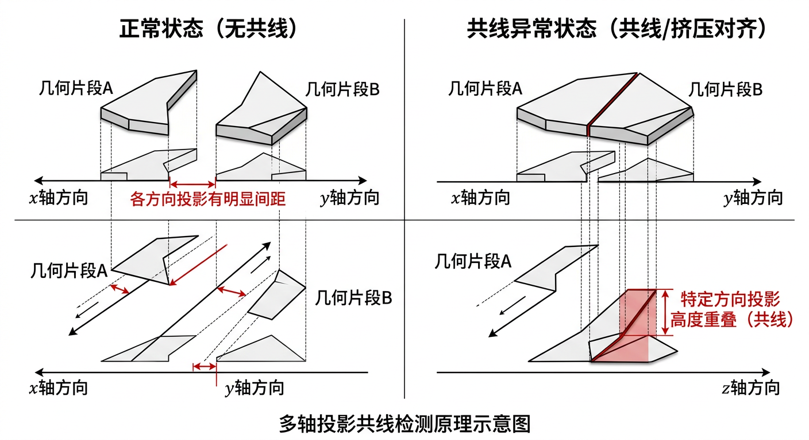

## 交底书名称

一种基于分离轴定理的角色蒙皮共线与形变异常检测方法、系统及存储介质

---

## 缩略语和关键术语定义

- **SAT（Separating Axis Theorem，分离轴定理）**：判断两个凸几何体是否相交的经典理论。若存在某轴使两体投影区间不重叠则两体分离；本发明将其推广用于局部结构形态异常度量。
- **共线异常（Collinearity Anomaly）**：细长结构在局部窗口内方向过度趋同、近乎退化到单轴排列的异常形态，表现为压扁、聚拢或"塌陷"。
- **翻折异常（Fold/Flip Anomaly）**：局部面片法线方向突变或反转，导致几何体出现折痕、压扁或体积塌陷的异常状态。
- **检测对象（Detection Object）**：用于计算指标的局部几何单元，可为连续边序列（边链）、邻域面片簇或骨骼影响域块。
- **候选轴集合（Candidate Axis Set）**：对每个检测对象生成的一组方向轴，用于SAT投影比较，包含边切向轴、法线轴、主方向轴及组合轴。
- **投影区间（Projection Interval）**：对象所有点在某方向轴上投影值的最小-最大范围，记为 \([l, u]\)。
- **重叠度（Overlap Ratio）**：两投影区间重叠长度与区间尺度之比，刻画分离能力衰退趋势。
- **分离裕量（Separation Margin）**：两投影区间之间的间距（非重叠时为正），越大表示分离越充分。
- **轴向各向异性（Axial Anisotropy）**：对象在不同方向轴上重叠度或分离度的方差，反映局部结构几何退化程度。
- **持续性评分（Persistence Score）**：异常在时间序列中的累计程度，通过持续帧计数或指数加权计算，区分瞬时噪声与结构性退化。
- **连通域定位（Connected Component Localization）**：将异常顶点或边按拓扑邻接聚类，得到区域级定位结果。
- **规则版本（Rule Version）**：指标公式、候选轴策略、阈值和聚合系数的版本化配置，支持跨版本回归比较与审计追溯。

---

## 1、*本发明的技术关键点（欲保护点）

本发明面向角色动画蒙皮质量评估场景，提出一种"基于分离轴定理的共线/形变异常指标体系"。该方案将局部几何片段构造为标准化检测对象，在多轴投影空间内计算分离与重叠关系，结合角度突变、曲率变化和长度畸变等几何特征，构建共线分数与形变分数，并通过跨帧持续性判定输出稳定告警，实现对细长结构蒙皮异常的自动检测与区域定位。

本发明欲保护的技术关键点由以下六个机制构成：

**关键点一：检测对象构建机制**
将原始网格按部位分组划分为标准化局部计算单元，包括固定长度边链窗口 \(C_j\) 和以中心面为核的面片簇 \(P_j\)，建立索引与拓扑邻接关系，是后续投影计算的输入前提。

**关键点二：候选分离轴生成机制**
在每个检测对象内自动生成候选轴集合 \(\mathcal{A}_j\)，包含边切向均值轴、面法线轴、PCA主方向轴及叉积组合轴，通过最小角度筛选去冗余。

**关键点三：SAT投影特征计算机制**
对每对检测对象在各候选轴上计算投影区间，提取重叠长度、分离裕量、归一化重叠比及跨轴汇总统计量（\(d_{\min}\)、\(r_{\max}\)、\(u_{\text{ani}}\)），形成对共线挤压和方向退化敏感的几何特征向量。

**关键点四：复合异常评分机制**
将SAT投影特征与角度突变、曲率变化、长度畸变和法线翻折等几何特征联合，构建共线分数 \(S_{\text{col}}\) 和形变分数 \(S_{\text{def}}\)，加权合并为综合异常分数 \(S\)，并给出各特征触发依据。

**关键点五：跨帧持续性判定机制**
采用指数加权平滑和持续帧计数两级机制，过滤瞬时噪声，仅在异常持续帧数超过阈值 \(K\) 时触发稳定告警。

**关键点六：区域级可解释定位机制**
将超阈值检测对象映射回顶点/边集合，在拓扑图上执行连通域聚类，输出异常区域边界、主导触发轴、触发特征和严重度分级，支持人工复核与修复定向调用。

本发明重点在于"SAT多轴投影指标的定义与计算流程"，不涉及碰撞穿插检测或训练数据闭环，可作为独立指标型专利部署，也可作为专利2评估框架的可插拔指标模块。

---

## 2、*与本发明最相近的现有技术

当前与本发明接近的技术主要来自三类：几何碰撞检测方法、网格质量分析工具，以及人工阈值筛查流程。这三类方案对"共线+形变"复合问题的多轴量化、跨帧稳定判定和区域级可解释定位能力明显不足。

### 2.1 现有技术的技术方案

**方案一：人工目检方案**
动画师逐帧检查头发和布料序列，判断压扁、翻折或共线状态。直观但成本高、吞吐低，一致性差。

**方案二：单一角度阈值方案**
以相邻边夹角或二面角为唯一依据，超阈值即报异常。实现简单，但对多方向同时退化而单角度未超阈值的共线情形灵敏度不足。

**方案三：纯碰撞/穿插检测方案**
依赖几何相交测试，能覆盖明显穿插类问题，但对未发生相交却已出现形态退化的共线或翻折现象覆盖能力有限。

**方案四：学习预测方案**
神经网络直接输出质量标签，推理速度快，但阈值语义不透明，触发原因不可解释，工程调参和版本化管理困难。

**方案五：静态单帧评估方案**
仅分析当前帧几何状态，不考虑时间连续性，容易将采样抖动引起的瞬时异常误判为结构性退化，告警稳定性差。

### 2.2 现有技术缺点及本发明解决的问题

**缺陷一：共线异常刻画不足。** 传统单轴角度阈值无法稳定反映局部结构多方向同步退化趋势。本发明通过SAT多轴投影计算各方向分离/重叠特征，提升共线形态刻画能力。

**缺陷二：翻折与挤压区分不清。** 单一指标常混淆不同机制的异常。本发明分别构建 \(S_{\text{col}}\) 和 \(S_{\text{def}}\)，输出具体触发特征，实现类型区分。

**缺陷三：缺少跨帧持续性判断。** 仅单帧判断导致误报率偏高。本发明引入指数平滑与持续帧计数双重机制，提升告警稳定性。

**缺陷四：缺少区域级可解释定位。** 现有方案多只输出样本级标签。本发明输出连通域定位与主导触发轴，实现可解释排障。

**缺陷五：跨角色迁移性弱。** 本发明通过检测对象标准化和分部位分层阈值策略，降低跨项目迁移成本。

本发明要解决的核心问题是：如何在不依赖人工标注的情况下，构建一套可解释、可泛化、跨帧稳定的共线/形变异常检测指标。

---

## 3、*本发明技术方案的详细阐述

本发明分为产品侧部署和技术侧算法两部分，构成可实施的指标检测系统。

### 3.1 产品侧

产品侧将本发明封装为"SAT异常指标插件"，可接入离线质检工具、动画编辑器或批处理服务。部署流程如下：

**步骤一：资产接入与对象配置。** 加载顶点序列、网格拓扑、部位分组映射和可选骨骼影响域；按部位类型（头发束→边链窗口，布料→面片簇，附件→自定义）选择检测对象模板，配置窗口长度 \(L\) 和扩展半径 \(r\)。

**步骤二：规则配置。** 配置候选轴策略（轴种类、去冗余角度阈值 \(\theta_{\min}\)）、各特征权重（\(\alpha_1\sim\alpha_4\), \(\beta_1\sim\beta_4\), \(\lambda\)）、持续帧阈值 \(K\) 和告警严重度级别。

**步骤三：批量执行。** 对单帧或序列运行SAT指标，输出每个检测对象的分数、定位区域和异常标签，写入结构化结果（JSON/数据库记录）。

**步骤四：可视化复核与报告归档。** 在视窗叠加异常热力图、触发轴可视化和严重度列表，支持交互跳转；写入规则版本、阈值配置、异常分布统计与跨版本趋势摘要。

产品侧支持离线批处理和交互预览两种模式，输出标准JSON/CSV格式，可被上层质量平台（如专利2）直接消费。

### 3.2 技术侧

技术侧流程为：对象构建 → 候选轴生成 → SAT投影特征计算 → 形变特征计算 → 复合评分 → 跨帧持续性判定 → 区域定位与输出。

#### 3.2.1 输入定义与检测对象构建

**输入定义：** 顶点序列 \(\mathbf{V}_{1:T} \in \mathbb{R}^{T\times N\times 3}\)（\(T\) 帧数，\(N\) 顶点数）；网格拓扑 \(\mathcal{M}=(\mathcal{V},\mathcal{E},\mathcal{F})\)；分组映射 \(\mathcal{G}\)（头发、布料、附件等），将顶点/面映射至部件标签；可选骨骼影响域 \(\mathcal{H}\)，用于语义化定位检测重点区域。

**检测对象构建：** 在每个部件组内构建两类对象：
1. **边链对象** \(C_j = (e_{j,1}, \ldots, e_{j,L})\)：长度为 \(L\) 的连续边序列，从头发束末端或布料边界提取。边链的起点选取规则为：沿部件组内度为1（末端）或曲率极值点的顶点开始，沿拓扑邻接方向依次收集 \(L\) 条连续边（典型 \(L=4\sim8\)）。边链间采用滑动窗口（步长 \(\Delta L = L/2\)）遍历，保证覆盖完整性。
2. **面片对象** \(P_j\)：以中心面为核、拓扑邻域半径 \(r\) 扩张得到的面簇。中心面通过面积加权重心与局部曲率极值筛选确定，扩张采用广度优先遍历，最大扩展 \(r\) 步（典型 \(r=2\sim4\)），得到包含 \(O(r^2)\) 个面片的局部簇。
3. **邻近对象对** \((A_j, B_j)\)：按拓扑邻接或空间距离构造，是SAT投影的基本输入单元。对象对的候选生成规则为：同部件组内拓扑距离在 \([L, 3L]\) 范围的边链对、空间距离小于 \(\tau_{\text{pair}}\) 的面片对。跨部件组的对象对由可检关系矩阵决定。

#### 3.2.2 候选轴集合生成

对每个对象对 \((A_j, B_j)\) 生成候选轴集合 \(\mathcal{A}_j\)，包含：边切向轴 \(\mathbf{t}\)（边向量均值）、法线轴 \(\mathbf{n}\)（面法线均值）、PCA主方向轴 \(\mathbf{p}_1\)（顶点协方差最大特征向量），以及三者两两叉积的归一化组合轴。具体生成步骤如下：

**步骤一：基础轴提取。** 对对象 \(A_j\)，计算其内部所有边向量 \(\mathbf{e}_k\) 的加权均值（权重为边长度），归一化得到边切向轴 \(\mathbf{t}_A\)；计算所有面法线 \(\mathbf{n}_k\) 的面积加权均值，归一化得到法线轴 \(\mathbf{n}_A\)；对对象内所有顶点坐标计算协方差矩阵 \(\mathbf{C} = \frac{1}{|A_j|}\sum_{\mathbf{x} \in A_j}(\mathbf{x}-\bar{\mathbf{x}})(\mathbf{x}-\bar{\mathbf{x}})^T\)，取最大特征值对应的特征向量作为PCA主方向轴 \(\mathbf{p}_{1,A}\)。对 \(B_j\) 同理。

**步骤二：组合轴生成。** 对 \(\{\mathbf{t}_A, \mathbf{n}_A, \mathbf{p}_{1,A}, \mathbf{t}_B, \mathbf{n}_B, \mathbf{p}_{1,B}\}\) 两两计算叉积 \(\mathbf{a}_{ij} = \mathbf{a}_i \times \mathbf{a}_j\)，归一化后加入候选集。

**步骤三：去冗余。** 对生成的轴执行去冗余：若两轴夹角 \(\angle(\mathbf{a}_i, \mathbf{a}_j) < \theta_{\min}\)（典型 \(\theta_{\min}=15°\sim20°\)），则保留在对象内方差贡献更大的轴（即沿该轴投影区间长度更大的轴），删除冗余轴。典型候选轴数 \(|\mathcal{A}_j| \in [4, 8]\)，平衡检测覆盖与计算开销。

#### 3.2.3 SAT投影特征计算

对任意轴 \(\mathbf{a} \in \mathcal{A}_j\)，对象 \(X\) 的投影区间定义为：

$$
I_X(\mathbf{a}) = \left[\min_{\mathbf{x}\in X}\langle\mathbf{x}, \mathbf{a}\rangle,\; \max_{\mathbf{x}\in X}\langle\mathbf{x}, \mathbf{a}\rangle\right].
$$

设 \(I_A = [l_A, u_A]\)，\(I_B = [l_B, u_B]\)，定义以下特征量：

**重叠长度：**
$$
\omega(\mathbf{a}) = \max\!\left(0,\; \min(u_A, u_B) - \max(l_A, l_B)\right).
$$

**分离裕量（有分离时为正）：**
$$
\delta(\mathbf{a}) = \max\!\left(0,\; \max(l_A, l_B) - \min(u_A, u_B)\right).
$$

**尺度归一化重叠比：**
$$
r(\mathbf{a}) = \frac{\omega(\mathbf{a})}{\max\!\left(\epsilon,\; \min(u_A - l_A,\; u_B - l_B)\right)}.
$$

跨全部候选轴汇总三个核心统计量：

$$
d_{\min} = \min_{\mathbf{a}\in\mathcal{A}_j} \delta(\mathbf{a}), \quad
r_{\max} = \max_{\mathbf{a}\in\mathcal{A}_j} r(\mathbf{a}), \quad
u_{\text{ani}} = \mathrm{Var}_{\mathbf{a}\in\mathcal{A}_j}\!\left(r(\mathbf{a})\right).
$$

在共线异常场景中，\(d_{\min}\) 下降（分离能力减弱），\(r_{\max}\) 上升（主轴方向高度重叠），三者联合刻画共线退化程度。

**SAT投影的物理直觉解释：** 在正常蒙皮状态下，两个相邻但独立的几何片段在多数方向轴上的投影区间应有明确间隔（分离裕量为正），且各方向上的重叠比应较均匀（各向异性低）。当共线异常发生时，两片段在某个主方向上趋于"挤压对齐"，导致该方向上投影高度重叠（\(r_{\max}\) 接近1），而在垂直方向上间距骤降（\(d_{\min}\) 趋近0），同时各方向重叠比的方差 \(u_{\text{ani}}\) 显著增大——这正是结构从三维空间退化为近似一维排列的几何特征。

#### 3.2.4 形变几何特征计算

在SAT特征基础上融合以下四类几何变化特征，执行线性裁剪归一化 \(z_i = \mathrm{clip}\!\left(\frac{f_i - \tau_i^{\text{low}}}{\tau_i^{\text{high}} - \tau_i^{\text{low}}}, 0, 1\right)\)：

1. **角度突变 \(f_\theta\)**：边链相邻边切向夹角最大变化量 \(\Delta\theta = \max_j|\theta_j - \bar{\theta}|\)，其中 \(\theta_j = \arccos(\hat{\mathbf{e}}_j \cdot \hat{\mathbf{e}}_{j+1})\) 为第 \(j\) 条边与第 \(j+1\) 条边的夹角，\(\bar{\theta}\) 为边链内所有相邻边夹角的均值。当边链发生局部折叠时，某一处 \(\theta_j\) 会远离均值，\(f_\theta\) 升高。典型阈值区间 \(\tau_\theta^{\text{low}}=10°, \tau_\theta^{\text{high}}=60°\)。
2. **曲率变化 \(f_\kappa\)**：局部离散曲率相对参考帧的变化率 \(|\kappa_t - \kappa_0|/\max(\epsilon, |\kappa_0|)\)，其中离散曲率 \(\kappa\) 采用余切权Laplacian算子的模长 \(\kappa(v) = \|L\mathbf{v}\|_2\) 近似。参考帧 \(\kappa_0\) 取绑定姿态下的曲率值，反映蒙皮引入的曲率畸变程度。
3. **长度畸变 \(f_\ell\)**：边长度相对绑定姿态的变化率 \(\Delta\ell/\ell_0 = (|\ell_t - \ell_0|)/\ell_0\)，其中 \(\ell_0\) 为绑定姿态下的边长，\(\ell_t\) 为当前帧的边长。该指标对布料拉伸和压缩均敏感，LBS固有的体积损失问题通常会导致此值偏高。
4. **法线翻折 \(f_n\)**：相邻面法线点积由正转负的比例 \(\#\{(f_i,f_j)\in\mathcal{E}_F : \langle\mathbf{n}_i,\mathbf{n}_j\rangle < 0\} / |\mathcal{E}_F|\)，其中 \(\mathcal{E}_F\) 为面片的对偶图中的边集（即共享公共边的面片对集合）。\(f_n > 0\) 意味着存在法线反转的面片对，是严重翻折异常的直接证据。

#### 3.2.5 共线/形变复合评分

**共线分数** \(S_{\text{col}}\) 综合SAT统计量与角度突变特征：

$$
S_{\text{col}} = \alpha_1 \hat{r}_{\max} + \alpha_2(1 - \hat{d}_{\min}) + \alpha_3 \hat{u}_{\text{ani}} + \alpha_4 z_\theta,
$$

其中 \(\hat{\cdot}\) 表示归一化量，\(\alpha_1 + \alpha_2 + \alpha_3 + \alpha_4 = 1\)。

**形变分数** \(S_{\text{def}}\) 综合几何形变特征与SAT辅助统计：

$$
S_{\text{def}} = \beta_1 z_\kappa + \beta_2 z_\ell + \beta_3 z_n + \beta_4 \hat{r}_{\max},
$$

其中 \(\beta_1 + \beta_2 + \beta_3 + \beta_4 = 1\)。\(\hat{r}_{\max}\) 同时用于两个分数，以捕捉几何挤压与方向退化的共同特征。

**综合异常分数：**

$$
S = \lambda S_{\text{col}} + (1-\lambda) S_{\text{def}}, \quad \lambda \in [0,1].
$$

按阈值 \(\gamma_1 < \gamma_2\) 分为三级：\(S < \gamma_1\) 为正常，\(\gamma_1 \le S < \gamma_2\) 为可疑，\(S \ge \gamma_2\) 为异常。

#### 3.2.6 跨帧持续性判定

为降低瞬时噪声影响，采用两级持续性机制：

**指数平滑：**
$$
\bar{S}_t = \eta S_t + (1-\eta)\bar{S}_{t-1}, \quad \eta \in (0,1).
$$

**持续帧计数器：**
$$
c_t = \begin{cases} c_{t-1} + 1, & \bar{S}_t \ge \gamma_2 \\ 0, & \text{otherwise} \end{cases}
$$

当 \(c_t \ge K\) 时触发持续异常告警，有效区分瞬时抖动与结构性退化。

#### 3.2.7 区域定位与输出

将所有 \(\bar{S}_t \ge \gamma_2\) 的检测对象映射回顶点与边集合，在拓扑图上执行广度优先聚类，合并相邻异常单元形成连通域，输出：区域边界框与异常占比；主导异常类型（由 \(S_{\text{col}}\) 与 \(S_{\text{def}}\) 相对大小决定）；主导触发轴与触发特征；严重度分级与告警时间片段 \([t_{\text{start}}, t_{\text{end}}]\)。输出为标准JSON格式，可被上层质量平台（专利2）消费，也可作为修复模块（专利5）的触发输入。

#### 3.2.8 复杂度与工程实现

设每帧对象对数量为 \(M\)，每对象候选轴数为 \(K_a\)（典型值4到8），每轴投影点数均值为 \(P\)，则核心投影计算复杂度约为 \(O(MK_aP)\)。工程优化手段包括：

- **候选对预筛**：使用轴对齐包围盒（AABB）快速判断两对象空间距离，仅对AABB间距小于 \(\tau_{\text{pair}}\) 的对象对执行精确投影，可将候选对数量从 \(O(M^2)\) 级别降至 \(O(M)\) 级别。
- **轴集合帧间缓存复用**：对缓慢运动场景（帧间顶点位移 \(\|\Delta\mathbf{v}\|_{\max} < \tau_{\text{cache}}\)），复用上一帧的候选轴集合 \(\mathcal{A}_j\)，仅重新计算投影区间端点，节省PCA和叉积计算开销。缓存命中率在典型动画序列中可达60%-80%。
- **分组并行**：不同部件组的检测对象完全独立，可分配至独立线程/进程并行处理。头发束通常对象对数量最多，可进一步按束分片。
- **早停策略**：当某对象对在前2-3个候选轴上已检测到严重异常（\(r(\mathbf{a}) > 0.95\) 且 \(\delta(\mathbf{a}) < \epsilon\)），可跳过剩余轴计算直接标记为异常，减少约30%-50%的冗余计算。
- **增量更新**：对于序列检测场景，利用帧间时间相干性，仅对位移超过阈值的顶点所在的对象重新计算，其余对象沿用上一帧结果。

---

## 4、*技术方案所产生的有益效果

本发明在生产验证中具备以下有益效果：

**效果一：异常检测覆盖率显著提升**
相较单角度阈值方法，SAT多轴投影能够识别更多"未发生相交但形态已退化"的共线和翻折问题，对头发束末端聚拢、布料横截面压扁等轻度共线场景的检测灵敏度明显改善。

**效果二：误报率降低**
跨帧持续性判定机制有效过滤由动画插值误差或采样抖动引起的单帧瞬时超阈值，减少不必要告警，提高工程可用性。

**效果三：可解释性增强**
每次告警均输出主导触发轴、触发特征名称（如 \(z_n\)、\(r_{\max}\)）和区域定位结果，便于美术和工程快速定向修复，无需逐帧人工排查。

**效果四：跨项目迁移能力提升**
检测对象标准化与分部位阈值策略使得同一指标框架可在不同角色类型（短发、长发、裙摆、披风等）之间复用，只需调整阈值与权重参数即可适配新项目。

**效果五：工程集成友好**
插件化接口不依赖特定游戏引擎或训练框架，既可作为独立质检工具部署，也可作为专利2质量评估体系的可插拔指标模块，兼容性强。

---

## 5、发散思维，针对3中的技术方案，是否还有其他别的替代方案

在不改变本发明核心思想（SAT多轴投影指标 + 几何特征联合评分 + 跨帧持续判定）的前提下，可采用以下替代实施路径：

**替代方案一：检测对象替代。** 边链窗口可替换为样条曲线段、骨骼驱动顶点簇或体素化片段；面片簇可替换为曲率分水岭算法分割的语义面片区域。

**替代方案二：轴生成策略替代。** 候选轴可由离线统计自适应生成，或由轻量网络在运行时建议高风险轴，提升对特定部位的检测灵敏度。

**替代方案三：几何特征替代。** 角度突变和曲率特征可替换为体积保持误差、扭转角速度或边长分布熵等特征，适配不同结构类型。

**替代方案四：评分聚合替代。** 线性加权可替换为规则树、集成学习门控器或排序模型，只要保持分类型输出和可解释触发路径，均属本发明扩展范围。

**替代方案五：时序与定位替代。** 指数平滑可替换为滑窗中位数、卡尔曼滤波或变点检测；连通域聚类可替换为DBSCAN或谱聚类。

本发明的保护重点在于：以SAT为核心的多轴投影指标构建机制、与形变几何特征的联合评分方法、跨帧持续异常判定流程及可解释区域定位输出。

---

## 附件参考文献（如：专利/论文/网页/期刊）

[1] Gottschalk, S., Lin, M. C., & Manocha, D. (1996). OBBTree: A Hierarchical Structure for Rapid Interference Detection. ACM SIGGRAPH 1996. https://doi.org/10.1145/237170.237244

[2] Ericson, C. (2005). Real-Time Collision Detection. CRC Press / Morgan Kaufmann. https://www.routledge.com/Real-Time-Collision-Detection/Ericson/p/book/9781558607323

[3] Boyd, S., & Vandenberghe, L. (2004). Convex Optimization (Chapters on separation and projection). Cambridge University Press. https://web.stanford.edu/~boyd/cvxbook/bv_cvxbook.pdf

[4] CGAL — AABB Tree Package for geometry query and intersection (engineering reference). https://doc.cgal.org/latest/AABB_tree/index.html

[5] Open3D — Geometry processing and neighborhood operations (engineering reference). https://www.open3d.org/docs/release/

[6] Botsch, M., Kobbelt, L., Pauly, M., Alliez, P., & Lévy, B. (2010). Polygon Mesh Processing. CRC Press. https://www.pmp-book.org/

[7] Blender Manual — Mesh and Geometry Analysis Tools (industry practice reference). https://docs.blender.org/manual/en/latest/modeling/meshes/
