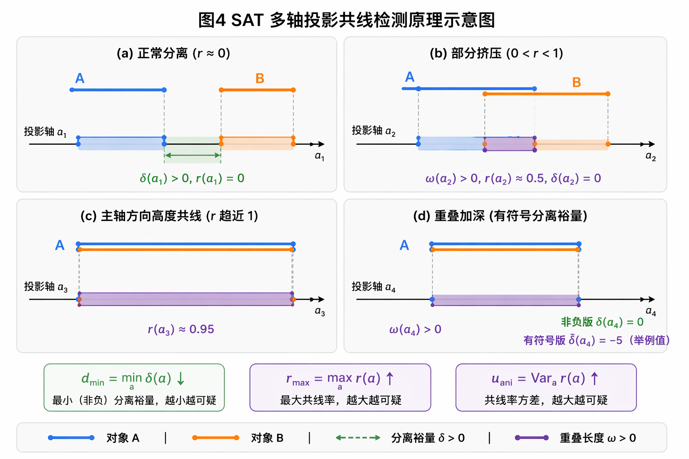

## 交底书名称

一种基于分离轴定理的角色蒙皮共线与形变异常检测方法、系统及存储介质

---

## 缩略语和关键术语定义

- **SAT（Separating Axis Theorem，分离轴定理）**：判断两个凸几何体是否相交的经典理论。若存在某轴使两体投影区间不重叠则两体分离；本发明将其推广用于局部结构形态异常度量。
- **共线异常（Collinearity Anomaly）**：细长结构在局部窗口内方向过度趋同、近乎退化到单轴排列的异常形态，表现为压扁、聚拢或"塌陷"。
- **翻折异常（Fold/Flip Anomaly）**：局部面片法线方向突变或反转，导致几何体出现折痕、压扁或体积塌陷的异常状态。
- **检测对象（Detection Object）**：用于计算指标的局部几何单元，可为连续边序列（边链）、邻域面片簇或骨骼影响域块。
- **候选轴集合（Candidate Axis Set）**：对每个检测对象生成的一组方向轴，用于SAT投影比较，包含边切向轴、法线轴、主方向轴及组合轴。
- **投影区间（Projection Interval）**：对象所有点在某方向轴上投影值的最小-最大范围，记为 \([l, u]\)。
- **重叠度（Overlap Ratio）**：两投影区间重叠长度与区间尺度之比，刻画分离能力衰退趋势。
- **分离裕量（Separation Margin）**：两投影区间之间的间距（非重叠时为正），越大表示分离越充分。
- **轴向各向异性（Axial Anisotropy）**：对象在不同方向轴上重叠度或分离度的方差，反映局部结构几何退化程度。
- **持续性评分（Persistence Score）**：异常在时间序列中的累计程度，通过持续帧计数或指数加权计算，区分瞬时噪声与结构性退化。
- **连通域定位（Connected Component Localization）**：将异常顶点或边按拓扑邻接聚类，得到区域级定位结果。
- **规则版本（Rule Version）**：指标公式、候选轴策略、阈值和聚合系数的版本化配置，支持跨版本回归比较与审计追溯。

---

## 1、*本发明的技术关键点（欲保护点）

本发明面向角色动画蒙皮质量评估场景，提出一种"基于分离轴定理的共线/形变异常指标体系"。该方案将局部几何片段构造为标准化检测对象，在多轴投影空间内计算分离与重叠关系，结合角度突变、曲率变化和长度畸变等几何特征，构建共线分数与形变分数，并通过跨帧持续性判定输出稳定告警，实现对细长结构蒙皮异常的自动检测与区域定位。

本发明欲保护的技术关键点由以下六个机制构成：

**关键点一：检测对象构建机制**
将原始网格按部位分组划分为标准化局部计算单元，包括固定长度边链窗口 \(C_j\) 和以中心面为核的面片簇 \(P_j\)，建立索引与拓扑邻接关系，是后续投影计算的输入前提。

**关键点二：候选分离轴生成机制**
在每个检测对象内自动生成候选轴集合 \(\mathcal{A}_j\)，包含边切向均值轴、面法线轴、PCA主方向轴及叉积组合轴，通过最小角度筛选去冗余。

**关键点三：SAT投影特征计算机制**
对每对检测对象在各候选轴上计算投影区间，提取重叠长度、分离裕量、归一化重叠比及跨轴汇总统计量（\(d_{\min}\)、\(r_{\max}\)、\(u_{\text{ani}}\)），形成对共线挤压和方向退化敏感的几何特征向量。

**关键点四：复合异常评分机制**
将SAT投影特征与角度突变、曲率变化、长度畸变和法线翻折等几何特征联合，构建共线分数 \(S_{\text{col}}\) 和形变分数 \(S_{\text{def}}\)，加权合并为综合异常分数 \(S\)，并给出各特征触发依据。

**关键点五：跨帧持续性判定机制**
采用指数加权平滑和持续帧计数两级机制，过滤瞬时噪声，仅在异常持续帧数超过阈值 \(K\) 时触发稳定告警。

**关键点六：区域级可解释定位机制**
将超阈值检测对象映射回顶点/边集合，在拓扑图上执行连通域聚类，输出异常区域边界、主导触发轴、触发特征和严重度分级，支持人工复核与修复定向调用。

本发明重点在于"SAT多轴投影指标的定义与计算流程"，不涉及碰撞穿插检测或训练数据闭环，可作为独立指标型方案部署，也可作为上层质量评估框架的可插拔指标模块。

---

## 2、*与本发明最相近的现有技术

当前与本发明接近的技术主要来自三类：几何碰撞检测方法、网格质量分析工具，以及人工阈值筛查流程。这三类方案对"共线+形变"复合问题的多轴量化、跨帧稳定判定和区域级可解释定位能力明显不足。

### 2.1 现有技术的技术方案

**方案一：人工目检方案**
动画师逐帧检查头发和布料序列，判断压扁、翻折或共线状态。直观但成本高、吞吐低，一致性差。

**方案二：单一角度阈值方案**
以相邻边夹角或二面角为唯一依据，超阈值即报异常。实现简单，但对多方向同时退化而单角度未超阈值的共线情形灵敏度不足。

**方案三：纯碰撞/穿插检测方案**
依赖几何相交测试，能覆盖明显穿插类问题，但对未发生相交却已出现形态退化的共线或翻折现象覆盖能力有限。

**方案四：学习预测方案**
神经网络直接输出质量标签，推理速度快，但阈值语义不透明，触发原因不可解释，工程调参和版本化管理困难。

**方案五：静态单帧评估方案**
仅分析当前帧几何状态，不考虑时间连续性，容易将采样抖动引起的瞬时异常误判为结构性退化，告警稳定性差。

### 2.2 现有技术缺点及本发明解决的问题

**缺陷一：共线异常刻画不足。** 传统单轴角度阈值无法稳定反映局部结构多方向同步退化趋势。本发明通过SAT多轴投影计算各方向分离/重叠特征，提升共线形态刻画能力。

**缺陷二：翻折与挤压区分不清。** 单一指标常混淆不同机制的异常。本发明分别构建 \(S_{\text{col}}\) 和 \(S_{\text{def}}\)，输出具体触发特征，实现类型区分。

**缺陷三：缺少跨帧持续性判断。** 仅单帧判断导致误报率偏高。本发明引入指数平滑与持续帧计数双重机制，提升告警稳定性。

**缺陷四：缺少区域级可解释定位。** 现有方案多只输出样本级标签。本发明输出连通域定位与主导触发轴，实现可解释排障。

**缺陷五：跨角色迁移性弱。** 本发明通过检测对象标准化和分部位分层阈值策略，降低跨项目迁移成本。

本发明要解决的核心问题是：如何在不依赖人工标注的情况下，构建一套可解释、可泛化、跨帧稳定的共线/形变异常检测指标。

---

## 3、*本发明技术方案的详细阐述

本发明分为产品侧部署和技术侧算法两部分，构成可实施的指标检测系统。

### 3.1 产品侧

产品侧将本发明封装为"SAT异常指标插件"，可接入离线质检工具、动画编辑器或批处理服务。部署流程如下：

**步骤一：资产接入与对象配置。** 加载顶点序列、网格拓扑、部位分组映射和可选骨骼影响域；按部位类型选择**唯一一种**检测对象模板（一个部位组件要么作为边链集合处理，要么作为面片簇集合处理，二者互斥；典型映射为：头发束→边链窗口、布料→面片簇、附件→自定义模板，自定义模板最终也仍归到"边链"或"面片簇"两类之一），并配置对应模板的窗口长度 \(L\) 或扩展半径 \(r\)。当一个部位同时具备线状骨架与片状面片时（如带飘带的披风），可在分组映射 \(\mathcal{G}\) 阶段将其拆为两个子部位（飘带子部位走边链、主体子部位走面片簇），保证每个子部位仍只对应单一模板。

**步骤二：规则配置。** 配置候选轴策略（轴种类、去冗余角度阈值 \(\theta_{\min}\)）、各特征权重（\(\alpha_1\sim\alpha_4\), \(\beta_1\sim\beta_4\), \(\lambda\)）、持续帧阈值 \(K\) 和告警严重度级别。

**步骤三：批量执行。** 对单帧或序列运行SAT指标，输出每个检测对象的分数、定位区域和异常标签，写入结构化结果（JSON/数据库记录）。

**步骤四：可视化复核与报告归档。** 在视窗叠加异常热力图、触发轴可视化和严重度列表，支持交互跳转；写入规则版本、阈值配置、异常分布统计与跨版本趋势摘要。

产品侧支持离线批处理和交互预览两种模式，输出标准JSON/CSV格式，可被上层质量评估平台直接消费。

### 3.2 技术侧

技术侧流程为：对象构建 → 候选轴生成 → SAT投影特征计算 → 形变特征计算 → 复合评分 → 跨帧持续性判定 → 区域定位与输出。

#### 3.2.1 输入定义与检测对象构建

**输入定义：** 顶点序列 \(\mathbf{V}_{1:T} \in \mathbb{R}^{T\times N\times 3}\)，记录 \(T\) 帧每帧 \(N\) 个顶点的三维坐标，下标 \(1{:}T\) 表示帧序列范围，\(T\) 为序列总帧数，\(N\) 为单帧顶点数；网格拓扑 \(\mathcal{M}=(\mathcal{V},\mathcal{E},\mathcal{F})\)，其中 \(\mathcal{V}\) 为顶点集合（与逐帧坐标解耦的索引集），\(\mathcal{E}\) 为无向边集合（每条边为顶点对 \((i,j)\)），\(\mathcal{F}\) 为面片集合（每个面片为顶点三元组）；分组映射 \(\mathcal{G}\) 是从顶点（或面片）索引到部件标签的函数（如顶点 \(v\to\)\("头发"/"布料"/"附件"\) 等），用于将整体网格切分为不同部件子集；可选骨骼影响域 \(\mathcal{H}\)，给出每根骨骼所支配的顶点子集与权重，用于在告警阶段做语义化定位（如"该异常发生在 left\_arm 影响域"）。

**检测对象构建：** 在每个部件组内构建两类对象：

1. **边链对象** \(C_j = (e_{j,1}, \ldots, e_{j,L})\)：下标 \(j\) 表示在当前部件组内枚举得到的第 \(j\) 个边链（按起点顶点扫描顺序编号）；\(e_{j,k}\) 表示第 \(j\) 个边链的第 \(k\) 条边；这里的 \(L\) 是"窗口长度"（即每个边链所包含的边数），仅指条数，不指步长。边链的起点选取规则为：沿部件组内度为 1（末端）或曲率极值点的顶点开始，沿拓扑邻接方向依次收集 \(L\) 条连续边（典型 \(L=4\sim 8\)）。边链与边链之间采用滑动窗口策略遍历，记滑动步长为 \(\Delta L\)（与 \(L\) 是不同的量），典型取 \(\Delta L = L/2\)，保证覆盖完整性。**举例**（取 \(L=4\)，\(\Delta L = 2\)）：若部件内连续边索引为 \(e_1, e_2, \ldots, e_{10}\)，则依次抽取边链 \(C_1=(e_1,e_2,e_3,e_4)\)、\(C_2=(e_3,e_4,e_5,e_6)\)、\(C_3=(e_5,e_6,e_7,e_8)\)、\(C_4=(e_7,e_8,e_9,e_{10})\)，相邻两条边链有 2 条边的重叠，从而避免在窗口边界处漏检。
2. **面片对象** \(P_j\)：以中心面为核、按拓扑邻域逐层扩张得到的面簇，下标 \(j\) 表示在当前部件组内枚举得到的第 \(j\) 个面簇。中心面的选取分两阶段进行：

   **阶段 A — 局部极大值候选筛选。** 在部件组内对每个面片同时计算"面积加权重心评分"（鼓励面积较大的面片）与"局部曲率极值评分"（鼓励曲率显著的面片），二者相乘得到综合评分。逐面片在面片对偶图（面片为节点、共边面片相连）上检视其一环邻面，若该面片综合评分**严格高于其所有共边邻面**，即称为"局部极大值"，加入候选集 \(\mathcal{C}_{\text{cand}}\)。

   **阶段 B — 非极大值抑制（NMS）排序贪心。** 将 \(\mathcal{C}_{\text{cand}}\) 按综合评分降序排列，从最高分者开始依次"接纳"加入最终中心面集合 \(\mathcal{C}_{\text{center}}\)；每接纳一个，立即把它在对偶图上拓扑距离 \(\le r_{\text{nms}}\)（典型 \(r_{\text{nms}}=2r\)）以内的所有其他候选从 \(\mathcal{C}_{\text{cand}}\) 中剔除（认为它们离已接纳点过近、互为冗余），再继续从剩余最高分者接纳。**举例**：若 \(\mathcal{C}_{\text{cand}}=\{f_a:0.92, f_b:0.85, f_c:0.78, f_d:0.60\}\) 按评分降序，且 \(f_a\) 与 \(f_b\) 在对偶图上距离 1 跳（\(\le r_{\text{nms}}\)），\(f_a\) 与 \(f_c\) 距离 5 跳，\(f_a\) 与 \(f_d\) 距离 6 跳，则接纳 \(f_a\)、剔除 \(f_b\)；再考察 \(f_c\)，与 \(f_a\) 距离 5 跳满足 \(>r_{\text{nms}}\)，接纳 \(f_c\)；最后考察 \(f_d\)，假设其与 \(f_c\) 距离 1 跳，被剔除。最终 \(\mathcal{C}_{\text{center}}=\{f_a, f_c\}\)。

   **几何含义：** \(\mathcal{C}_{\text{center}}\) 中的中心面彼此在对偶图上距离较远，且每个都是其所在区域内"又大又弯"的代表面，避免在同一异常热点区域产生多个高度重叠的面簇。

   **扩张过程：** 对每个最终中心面，在面片对偶图上从该中心面开始执行广度优先遍历，遍历跳数（即从中心面出发经过的面-面相邻跳数）最大为 \(r\) 步（典型 \(r=2\sim 4\)），所有跳数 \(\le r\) 的面片纳入面簇，得到包含 \(O(r^2)\) 个面片的局部簇。需要指出：此处的 \(r\) 仅指"对偶图上的扩张步数（跳数）"，不指空间欧氏半径；之所以称为"半径"，是因为它在对偶图测度上的作用类似于半径。**举例**（取 \(r=2\)）：以中心面 \(f_0\) 为起点，第 1 步纳入 \(f_0\) 的所有共边邻面 \(\{f_1,f_2,f_3\}\)（典型三角面有 3 个共边邻面），第 2 步再纳入它们各自尚未访问的共边邻面 \(\{f_4,\ldots\}\)，最终得到包含 \(\sim 10\) 个面片的面簇。
3. **邻近对象对** \((A_j, B_j)\)：在已构建的边链对象集合（或面片对象集合）内部两两组合而成的"对象对"，是 SAT 投影的基本输入单元；这里的 \(j\) 是对"对象对"重新枚举的下标（即"第 \(j\) 个对象对"），与单个边链/面簇的下标不同。对象对的候选生成规则为：同部件组内拓扑距离（最短拓扑路径上的边数）在 \([L, 3L]\) 范围的边链对、**两面簇各自的轴对齐包围盒（AABB）中心点之间的欧氏距离小于 \(\tau_{\text{pair}}\) 的面片簇对**（与 §3.2.8 中"AABB 预筛"使用同一个 \(\tau_{\text{pair}}\) 阈值，典型 \(\tau_{\text{pair}}\) 取角色高度的 0.5%–2%）；跨部件组的对象对由可检关系矩阵决定（例如"头发-布料"是否参与互检）。

#### 3.2.2 候选轴集合生成

对每个对象对 \((A_j, B_j)\) 生成候选轴集合 \(\mathcal{A}_j\)（这里下标 \(j\) 仍指"第 \(j\) 个对象对"），用于后续 SAT 多轴投影。候选轴集合包含：边切向轴 \(\mathbf{t}\)、法线轴 \(\mathbf{n}\)、PCA 主方向轴 \(\mathbf{p}_1\)，以及三者两两叉积的归一化组合轴。需要说明的是：本发明不强行区分对象类型——无论是"边链对象"还是"面片对象"，三类基础轴均统一计算（差异在于权重不同，详见步骤一），统一接口的好处是同一套投影流程能同时处理"边链-边链对"、"面片-面片对"以及未来可能扩展的"边链-面片混合对"。

**步骤一：基础轴提取。** 对对象 \(A_j\) 内部所有边向量 \(\mathbf{e}_k\)，以边长度为权重计算加权均值并归一化，得到边切向轴 \(\mathbf{t}_A\)（边链对象边数较多，该轴最具判别力；面片对象的边切向轴退化为面边的均值方向，仍可计算，但通常判别力较弱）；对对象内所有面片的法线 \(\mathbf{n}_k\)，以**面积**为权重计算加权均值并归一化，得到法线轴 \(\mathbf{n}_A\)（即面积越大的面片，其法线方向对均值的贡献越大；面片对象法线最具判别力，边链对象的相邻面法线轴可作为辅助信息）；对对象内所有顶点坐标计算协方差矩阵 \(\mathbf{C} = \frac{1}{|A_j|}\sum_{\mathbf{x} \in A_j}(\mathbf{x}-\bar{\mathbf{x}})(\mathbf{x}-\bar{\mathbf{x}})^T\)，取最大特征值对应的特征向量作为 PCA 主方向轴 \(\mathbf{p}_{1,A}\)（描述顶点分布的最大延展方向，对边链与面片对象均同样适用）。对 \(B_j\) 同理。

**步骤二：组合轴生成。** 将 \(A_j\)、\(B_j\) 的六类基础轴 \(\{\mathbf{t}_A, \mathbf{n}_A, \mathbf{p}_{1,A}, \mathbf{t}_B, \mathbf{n}_B, \mathbf{p}_{1,B}\}\) 两两计算叉积 \(\mathbf{a}_{ij} = \mathbf{a}_i \times \mathbf{a}_j\)（共 \(\binom{6}{2}=15\) 条），归一化后加入候选集，再与 6 条基础轴合并，得到候选轴集合的初始规模约 21 条。

**步骤三：去冗余。** 在初始 21 条候选轴上执行去冗余：依次检查所有轴对，若两轴夹角 \(\angle(\mathbf{a}_i, \mathbf{a}_j) < \theta_{\min}\)（典型 \(\theta_{\min}=15°\sim 20°\)），则保留"在对象内方差贡献更大的轴"——即沿该轴投影区间长度（\(u-l\)，见 §3.2.3 中 \(I_X(\mathbf{a})\) 定义）更大的那条，删除另一条。**举例**：若 \(\mathbf{a}_1\) 与 \(\mathbf{a}_2\) 夹角 12°（小于 15°），且 \(A_j\) 在 \(\mathbf{a}_1\) 上投影长度为 0.42，在 \(\mathbf{a}_2\) 上投影长度为 0.31，则删除 \(\mathbf{a}_2\) 保留 \(\mathbf{a}_1\)。

为消除"删除决策冲突"（如：\(\mathbf{a}_1\) 与 \(\mathbf{a}_2\) 比较时建议保留 \(\mathbf{a}_1\)，但 \(\mathbf{a}_1\) 与 \(\mathbf{a}_3\) 比较时又被建议删除 \(\mathbf{a}_1\)），实施时按"投影长度从大到小排序后顺序贪心保留"的方案确保确定性：

**具体规则。** 将所有候选轴按其在 \(A_j\) 与 \(B_j\) 上的投影长度之和降序排列，得到序列 \(\mathbf{a}_{(1)}, \mathbf{a}_{(2)}, \ldots, \mathbf{a}_{(21)}\)；初始化最终集合 \(\mathcal{A}_j = \emptyset\)。从最高分者起依次考察：第 1 条轴 \(\mathbf{a}_{(1)}\) 直接接纳（\(\mathcal{A}_j \leftarrow \{\mathbf{a}_{(1)}\}\)）；考察第 \(k\) 条轴 \(\mathbf{a}_{(k)}\)（\(k\ge 2\)）时，**逐一**计算它与 \(\mathcal{A}_j\) 中**每一条**已接纳轴的夹角——**只要存在任意一条已接纳轴与之夹角 \(<\theta_{\min}\)，立即丢弃 \(\mathbf{a}_{(k)}\)、不再继续比较**；若所有夹角均 \(\ge\theta_{\min}\)，则接纳（\(\mathcal{A}_j \leftarrow \mathcal{A}_j\cup\{\mathbf{a}_{(k)}\}\)）。

**举例**（取 \(\theta_{\min}=15°\)）：投影长度降序排列后前 4 条为 \(\mathbf{a}_{(1)}, \mathbf{a}_{(2)}, \mathbf{a}_{(3)}, \mathbf{a}_{(4)}\)。
- 接纳 \(\mathbf{a}_{(1)}\)，\(\mathcal{A}_j=\{\mathbf{a}_{(1)}\}\)。
- 考察 \(\mathbf{a}_{(2)}\)：与 \(\mathbf{a}_{(1)}\) 夹角 25°（\(\ge 15°\)），接纳，\(\mathcal{A}_j=\{\mathbf{a}_{(1)},\mathbf{a}_{(2)}\}\)。
- 考察 \(\mathbf{a}_{(3)}\)：与 \(\mathbf{a}_{(1)}\) 夹角 20°、与 \(\mathbf{a}_{(2)}\) 夹角 12°（\(<15°\)）——立即丢弃 \(\mathbf{a}_{(3)}\)。
- 考察 \(\mathbf{a}_{(4)}\)：与 \(\mathbf{a}_{(1)}\) 夹角 30°、与 \(\mathbf{a}_{(2)}\) 夹角 22°，全部满足，接纳，\(\mathcal{A}_j=\{\mathbf{a}_{(1)},\mathbf{a}_{(2)},\mathbf{a}_{(4)}\}\)。

该贪心规则可保证每条最终保留的轴在其所属"邻域"中均为投影最显著者，避免上述循环冲突。典型最终候选轴数 \(|\mathcal{A}_j| \in [4, 8]\)，平衡检测覆盖与计算开销。

#### 3.2.3 SAT投影特征计算

对任意轴 \(\mathbf{a} \in \mathcal{A}_j\)，对象 \(X\)（这里 \(X\) 是占位符，代入对象对中的 \(A_j\) 或 \(B_j\) 即得对应区间）的投影区间定义为：

$$
I_X(\mathbf{a}) = \left[\min_{\mathbf{x}\in X}\langle\mathbf{x}, \mathbf{a}\rangle,\; \max_{\mathbf{x}\in X}\langle\mathbf{x}, \mathbf{a}\rangle\right].
$$

其中 \(\mathbf{x}\) 表示对象 \(X\) 内的某一个顶点的三维坐标向量；\(\langle\mathbf{x}, \mathbf{a}\rangle = \mathbf{x}\cdot\mathbf{a}\) 为向量 \(\mathbf{x}\) 在轴向量 \(\mathbf{a}\) 上的标量投影（即点积，结果为一个标量）；\(\min_{\mathbf{x}\in X}\) 与 \(\max_{\mathbf{x}\in X}\) 表示对对象 \(X\) 中所有顶点的标量投影分别取最小与最大值——故 \(I_X(\mathbf{a})\) 是一个一维闭区间，反映对象 \(X\) 在轴 \(\mathbf{a}\) 上的"投影范围"。

设 \(I_A = [l_A, u_A]\)，\(I_B = [l_B, u_B]\)，定义以下特征量：

**重叠长度（恒非负，>0 表示两区间在该轴上有重叠）：**
$$
\omega(\mathbf{a}) = \max\!\left(0,\; \min(u_A, u_B) - \max(l_A, l_B)\right).
$$

**有符号分离裕量（>0 表示两区间分离、=0 表示恰好相切、<0 表示发生重叠且其绝对值反映重叠深度）：**
$$
\tilde{\delta}(\mathbf{a}) = \max(l_A, l_B) - \min(u_A, u_B).
$$

为便于汇总比较，本发明同时保留只刻画"分离侧"的非负版本：
$$
\delta(\mathbf{a}) = \max\!\left(0,\; \tilde{\delta}(\mathbf{a})\right),
$$

即 \(\delta\) 仅在分离时取正值、重叠时归零；重叠深度信息由 \(\omega\) 和下面的 \(r\) 单独承担。换言之，"分离方向"用 \(\delta\) 描述，"重叠方向"用 \(\omega/r\) 描述，二者不会同时为正。

**尺度归一化重叠比（即"缩略语"中所定义的"重叠度"）：**
$$
r(\mathbf{a}) = \frac{\omega(\mathbf{a})}{\max\!\left(\epsilon,\; \min(u_A - l_A,\; u_B - l_B)\right)}.
$$

其中 \(\epsilon\) 为防除零的小正数；分母 \(\min(u_A-l_A,u_B-l_B)\) 取两区间长度的较小者，以"较小者"作为参考尺度，可保证两段长度悬殊的对象在比较时归一化稳定。\(r(\mathbf{a})\in[0,1]\)：取 0 即没有重叠，取 1 即两区间在该轴上完全重叠（即所谓的"重叠度接近 1"）。

跨全部候选轴汇总三个核心统计量：

$$
d_{\min} = \min_{\mathbf{a}\in\mathcal{A}_j} \delta(\mathbf{a}), \quad
r_{\max} = \max_{\mathbf{a}\in\mathcal{A}_j} r(\mathbf{a}), \quad
u_{\text{ani}} = \mathrm{Var}_{\mathbf{a}\in\mathcal{A}_j}\!\left(r(\mathbf{a})\right).
$$

在共线异常场景中，\(d_{\min}\) 下降（分离能力减弱），\(r_{\max}\) 上升（主轴方向高度重叠），三者联合刻画共线退化程度。

**SAT投影的物理直觉解释：** 在正常蒙皮状态下，两个相邻但独立的几何片段在多数方向轴上的投影区间应有明确间隔（\(\delta>0\)，\(r=0\)），且各方向上的重叠比 \(r\) 应较均匀（各向异性 \(u_{\text{ani}}\) 低）。当共线异常发生时，两片段在某个主方向上趋于"挤压对齐"，导致该方向上投影高度重叠（\(r_{\max}\) 接近 1，对应有符号分离裕量 \(\tilde\delta\) 取较大负值），而在垂直方向上间距骤降（\(d_{\min}\) 趋近 0），同时各方向重叠比的方差 \(u_{\text{ani}}\) 显著增大——这正是结构从三维空间退化为近似一维排列的几何特征。说明：图 4（SAT 多轴投影共线检测原理）右下角标注的"分离裕量 \(\delta\) 趋近 0"对应的是非负版本 \(\delta\) 在重叠时归零的取值；若需在可视化中保留重叠深度，可改用有符号版本 \(\tilde\delta\)（如 \(-5\) 表示重叠 5 个单位）。

#### 3.2.4 形变几何特征计算

在 SAT 特征基础上融合以下四类几何变化特征。其中**角度突变 \(f_\theta\)**、**长度畸变 \(f_\ell\)** 针对边链对象 \(C_j\) 计算（描述边链的方向折叠与长度伸缩）；**曲率变化 \(f_\kappa\)**、**法线翻折 \(f_n\)** 针对面片簇对象 \(P_j\) 计算（描述面簇的弯曲畸变与翻面退化）。

**为何按对象类型分别计算（不跨类型计算）。** 由 §3.1 步骤一可知，每个部位组件已被绑定为单一对象模板（边链或面片簇，二选一），因此一个部位的检测对象类型固定，跨类型特征对该部位不可用：
- "角度突变 \(f_\theta\)"按定义需要边链相邻边切向夹角，**面片簇上没有"沿链相邻边"这一概念**（面簇内边为面片三角形的三条边，无连续序），故不计算；
- "长度畸变 \(f_\ell\)"按定义针对边链每条边的长度变化率；面片簇虽然包含许多三角形边，但这些边的长度变化更直接地体现在**法线翻折 \(f_n\)** 与 SAT 投影特征（\(d_{\min}, r_{\max}\) 反映几何挤压）中，重复计算 \(f_\ell\) 会引入冗余信号；故面片簇不另计 \(f_\ell\)；
- "曲率变化 \(f_\kappa\)"以余切权 Laplacian 算子的模长定义，**算子本身要求顶点至少有两个不在同一直线上的邻居**（即 1-环邻域为面片，不为线）；边链顶点的邻居只在链方向上，曲率算子退化为二阶差分，性质等价于 \(f_\theta\) 的高阶版本，重复计算无新信息；故边链不另计 \(f_\kappa\)；
- "法线翻折 \(f_n\)"按定义需要面法线，**边链对象由顶点+边构成，无面法线**；故边链不计算 \(f_n\)。

综上，本发明四类形变特征与对象类型严格一一对应，**跨类型不计算**：边链上仅算 \(\{f_\theta, f_\ell\}\)，面片簇上仅算 \(\{f_\kappa, f_n\}\)。如果某个部位希望同时获得四类形变特征（如希望对一片披风同时刻画"边折叠"与"面翻面"），可在 §3.1 步骤一阶段将该部位拆为子部位（飘带子部位走边链、主体子部位走面片簇），分别在两个子部位上计算各自 2 类特征，再在 §3.2.5/§3.2.7 阶段合并部位级输出。

对每个特征 \(f_i\)（\(i\in\{\theta,\kappa,\ell,n\}\)）执行同一形式的线性裁剪归一化，将原始物理量映射到 \([0,1]\)，便于跨特征加权：
$$
z_i = \mathrm{clip}\!\left(\frac{f_i - \tau_i^{\text{low}}}{\tau_i^{\text{high}} - \tau_i^{\text{low}}}, 0, 1\right).
$$

其中 \(\tau_i^{\text{low}}\) 为"被认为是正常的上界"，\(\tau_i^{\text{high}}\) 为"被认为是严重异常的下界"：当 \(f_i \le \tau_i^{\text{low}}\) 时 \(z_i=0\)（视为正常）、当 \(f_i \ge \tau_i^{\text{high}}\) 时 \(z_i=1\)（视为严重异常）、中间为线性过渡，从而实现"软阈值化"的归一化（不是硬性二分类，而是以连续分数体现退化程度）。需要注意：每个特征 \(f_i\) 各有一对独立的 \((\tau_i^{\text{low}},\tau_i^{\text{high}})\) 阈值，下文逐项给出典型取值；阈值边界本身仅是"归一化区间端点"，不是"正常/异常硬切分点"——最终是否触发告警由 §3.2.5 的综合分数 \(S\) 与 §3.2.6 的持续帧机制共同决定。

1. **角度突变 \(f_\theta\)（针对边链 \(C_j\)）**：边链相邻边切向夹角最大变化量 \(\Delta\theta = \max_j|\theta_j - \bar{\theta}|\)，其中 \(\theta_j = \arccos(\hat{\mathbf{e}}_j \cdot \hat{\mathbf{e}}_{j+1})\) 为第 \(j\) 条边与第 \(j+1\) 条边的夹角，\(\bar{\theta}\) 为边链内所有相邻边夹角的均值。当边链发生局部折叠时，某一处 \(\theta_j\) 会远离均值，\(f_\theta\) 升高。典型阈值区间 \(\tau_\theta^{\text{low}}=10°\)、\(\tau_\theta^{\text{high}}=60°\)（即夹角变化量小于 10° 视为完全正常的边链摆动，大于 60° 视为严重折叠）。
2. **曲率变化 \(f_\kappa\)（针对面片簇 \(P_j\)）**：定义在面簇内的"逐顶点离散曲率畸变"再做面片簇级聚合。具体地，对面簇 \(P_j\) 的每个顶点 \(v\) 计算逐顶点离散曲率 \(\kappa(v) = \|L\mathbf{v}\|_2\)（\(L\) 为余切权 Laplacian 算子，\(\mathbf{v}\) 为该顶点坐标），将其与绑定姿态下同顶点的曲率 \(\kappa_0(v)\) 比较，得逐顶点变化率 \(\rho(v) = |\kappa_t(v)-\kappa_0(v)|/\max(\epsilon, |\kappa_0(v)|)\)；面簇级 \(f_\kappa\) 取所有顶点 \(\rho(v)\) 的"分位聚合"，本发明默认采用第 90 分位（\(f_\kappa = Q_{0.9}\{\rho(v)\}\)），即只要有 10% 的顶点出现严重曲率畸变即认为该面簇发生显著弯曲变化；若实施中需要更保守的判定，可改用最大值 \(\max_v\rho(v)\) 或均值 \(\mathrm{mean}_v\rho(v)\)。本发明不采用"随机选一个顶点"的方式，因为面簇内不同顶点的曲率畸变具有空间相关性，但仍存在明显方差，单点不足以代表整体。典型阈值 \(\tau_\kappa^{\text{low}}=0.20\)、\(\tau_\kappa^{\text{high}}=1.00\)（即第 90 分位变化率 20% 以下视为正常，达到 100% 即认为曲率发生量级变化）。
3. **长度畸变 \(f_\ell\)（针对边链 \(C_j\)）**：边长度相对绑定姿态的变化率 \(\Delta\ell/\ell_0 = (|\ell_t - \ell_0|)/\ell_0\)，其中 \(\ell_0\) 为绑定姿态下的边长，\(\ell_t\) 为当前帧的边长。该指标按"边链内每条边各算一次再做边链级聚合"的方式得到，本发明默认采用第 90 分位（\(f_\ell = Q_{0.9}\{\Delta\ell_e/\ell_{0,e}\,|\,e\in C_j\}\)）作为边链级单一标量；实施中也可改用 \(\max\) 或 \(\mathrm{mean}\)。该指标对布料拉伸和压缩均敏感，LBS 固有的体积损失问题通常会导致此值偏高。本指标只在边链对象上计算，**面片簇对象不另计 \(f_\ell\)**（理由见本节章首"为何按对象类型分别计算"——面簇上的边长变化已通过法线翻折与 SAT 投影特征间接体现，重复计算引入冗余）。典型阈值 \(\tau_\ell^{\text{low}}=0.05\)、\(\tau_\ell^{\text{high}}=0.30\)（即长度变化 5% 以下视为正常，30% 以上视为严重畸变）。
4. **法线翻折 \(f_n\)（针对面片簇 \(P_j\)）**：相邻面法线点积由正转负的比例 \(\#\{(f_i,f_j)\in\mathcal{E}_F : \langle\mathbf{n}_i,\mathbf{n}_j\rangle < 0\} / |\mathcal{E}_F|\)。这里"相邻面"指**同一面簇 \(P_j\) 内部**共享一条公共边的两张面片对（不是 \(A\)、\(B\) 跨面簇之间的面片对），\(\mathcal{E}_F\) 为面簇 \(P_j\) 在面片对偶图上的边集，即 \(\mathcal{E}_F = \{(f_i,f_j)\,|\, f_i, f_j \in P_j,\, f_i\) 与 \(f_j\) 共享一条公共边\(\}\)（两个面片若共享一条边，则在对偶图上视为相邻）。\(\langle\mathbf{n}_i,\mathbf{n}_j\rangle<0\) 表示这两张相邻面片的法线方向呈钝角，几何上对应"折痕翻面"或"法线反转"。\(f_n\in[0,1]\) 为这种"反向相邻面片对"在所有相邻面片对中所占的比例。\(f_n > 0\) 即意味着面簇内存在法线反转的面片对，是严重翻折异常的直接证据；\(f_n\) 越大，翻折范围越广。典型阈值 \(\tau_n^{\text{low}}=0\)、\(\tau_n^{\text{high}}=0.20\)（即出现任一翻折面片对即开始计分，反向比例达到 20% 视为严重）。

#### 3.2.5 共线/形变复合评分

**评分粒度的统一原则（关键）。** 为消除粒度混搭带来的语义歧义，本发明将所有分数统一定义在**对象级**——即对每一个检测对象 \(o\)（边链对象 \(C_j\) 或面簇对象 \(P_j\)）输出一个标量分数 \(S_{\text{col}}^{(o)}, S_{\text{def}}^{(o)}, S^{(o)}\)。这要求把 §3.2.3 输出的"对象对级 SAT 统计量"先升维到对象级。具体做法如下。

**步骤 A — SAT 统计量的对象级聚合。** §3.2.3 输出的 \(d_{\min}, r_{\max}, u_{\text{ani}}\) 是对一个对象对 \((A_j, B_j)\) 计算的；记对象 \(o\) 参与的全部对象对集合为 \(\mathcal{P}(o) = \{(A,B) : A=o \text{ 或 } B=o\}\)，定义对象级 SAT 三统计量为
$$
d_{\min}^{(o)} = \min_{(A,B)\in\mathcal{P}(o)} d_{\min}(A,B),\quad
r_{\max}^{(o)} = \max_{(A,B)\in\mathcal{P}(o)} r_{\max}(A,B),\quad
u_{\text{ani}}^{(o)} = \max_{(A,B)\in\mathcal{P}(o)} u_{\text{ani}}(A,B).
$$
直观语义：对象 \(o\) 自身的"最弱分离方向"取自它在所有对象对中表现最差的那一对——只要在任意一对邻居上发生显著挤压，本对象就视为有共线倾向。下文 \(\hat r_{\max}^{(o)}, \hat d_{\min}^{(o)}, \hat u_{\text{ani}}^{(o)}\) 表示再做 \([0,1]\) 归一化后的对象级量。

**步骤 B — 共线分数（按对象类型分别定义）。** SAT 三统计量对边链与面簇均适用；判别共线倾向的辅助形变特征则因对象类型而异：边链上能直接刻画"沿链方向退化"的是角度突变 \(z_\theta\)（值越大表示链方向越不规则），面簇上没有等价于"沿链相邻边夹角"的量，故仅采用 SAT 三统计量。综合得到：
$$
S_{\text{col}}^{(o)} =
\begin{cases}
\alpha_1\,\hat r_{\max}^{(o)} + \alpha_2\,(1-\hat d_{\min}^{(o)}) + \alpha_3\,\hat u_{\text{ani}}^{(o)} + \alpha_4\,z_\theta^{(o)}, & o = C_j \;\text{(边链)}, \\[2pt]
\tilde\alpha_1\,\hat r_{\max}^{(o)} + \tilde\alpha_2\,(1-\hat d_{\min}^{(o)}) + \tilde\alpha_3\,\hat u_{\text{ani}}^{(o)}, & o = P_j \;\text{(面簇)},
\end{cases}
$$
其中 \(\alpha_1+\alpha_2+\alpha_3+\alpha_4=1\)，\(\tilde\alpha_1+\tilde\alpha_2+\tilde\alpha_3=1\)。两套权重独立配置，因此**两类对象在公式形式上不一致是合理的**——它们度量的是各自类型对象的"共线倾向"，不要求项数相同；归一化保证结果都落在 \([0,1]\) 区间，便于后续跨类型比较。

**步骤 C — 形变分数（按对象类型分别定义）。** 形变特征本身就严格按对象类型分配（见 §3.2.4 章首），分数同样分两套：
$$
S_{\text{def}}^{(o)} =
\begin{cases}
\beta_1\,z_\theta^{(o)} + \beta_2\,z_\ell^{(o)}, & o = C_j \;\text{(边链)}, \\[2pt]
\tilde\beta_1\,z_\kappa^{(o)} + \tilde\beta_2\,z_n^{(o)}, & o = P_j \;\text{(面簇)},
\end{cases}
$$
其中 \(\beta_1+\beta_2=1\)，\(\tilde\beta_1+\tilde\beta_2=1\)。即：边链形变 = 角度突变 + 长度畸变；面簇形变 = 曲率变化 + 法线翻折。**这版公式不再混入跨类型不存在的特征，也不再把对象对级的 \(\hat r_{\max}\) 当作形变项。** 关于 \(z_\theta\) 同时出现在 \(S_{\text{col}}^{(C)}\) 与 \(S_{\text{def}}^{(C)}\)：两者的角色不同——前者刻画"链方向是否退化"（与 SAT 共同捕捉共线特征），后者刻画"折叠剧烈程度"（与 \(z_\ell\) 共同捕捉形变特征）；同一物理量在不同评分维度发挥不同作用，不构成重复计算（最终是否触发以综合分数 \(S\) 为准）。

**步骤 D — 综合异常分数。** 对同一对象 \(o\) 把其共线、形变两路分数加权合并：
$$
S^{(o)} = \lambda\,S_{\text{col}}^{(o)} + (1-\lambda)\,S_{\text{def}}^{(o)},\quad \lambda \in [0, 1].
$$
**两侧粒度一致**（都是对象级），因此加权聚合在量纲与语义上都是合法的。\(S^{(o)}\) 表示"对象 \(o\) 在当前帧的综合异常程度"，按阈值 \(\gamma_1<\gamma_2\) 分三级：\(S^{(o)}<\gamma_1\) 为正常，\([\gamma_1,\gamma_2)\) 为可疑，\(\ge\gamma_2\) 为异常。

#### 3.2.6 跨帧持续性判定

**逐对象、逐部位独立维护。** §3.2.5 输出的 \(S^{(o)}\) 是某对象在当前帧的瞬时分数；为过滤瞬时噪声，本节按"对象身份"逐对象单独做时间平滑与持续帧计数——**不同对象之间互不汇总**，这与批注 6 反馈的"综合异常分数应针对一个部位/对象"的逻辑一致。具体地，对每个对象 \(o\) 维护两个状态量：本帧平滑分数 \(\bar S_t^{(o)}\) 与本帧连续超阈值帧计数 \(c_t^{(o)}\)。

**指数平滑：**
$$
\bar S_t^{(o)} = \eta\,S_t^{(o)} + (1-\eta)\,\bar S_{t-1}^{(o)},\quad \eta\in(0,1),
$$
其中 \(S_t^{(o)}\) 为对象 \(o\) 在第 \(t\) 帧按 §3.2.5 公式计算的综合分数；\(\eta\) 为平滑系数（典型 \(\eta=0.3\)，越大越追随当前帧）；\(\bar S_0^{(o)} = S_0^{(o)}\)。

**持续帧计数器：**
$$
c_t^{(o)} = \begin{cases} c_{t-1}^{(o)}+1, & \bar S_t^{(o)}\ge \gamma_2,\\ 0, & \text{otherwise},\end{cases}
$$
\(c_0^{(o)}=0\)，\(\gamma_2\) 即 §3.2.5 中划分"异常"的高阈值。当 \(c_t^{(o)}\ge K\)（\(K\) 为最小持续帧数，典型 \(K=3\sim 5\)）时，对象 \(o\) 被标记为"持续异常对象"。**只要对象 \(o\) 自身的身份在跨帧间稳定（同一边链滑动窗口编号、同一面簇中心面），就一直在同一序列上累计，不会与其他对象的状态互相干扰。** 跨部件组的对象对仅参与 §3.2.3 的 SAT 投影计算（贡献到对象 \(o\) 的 \(d_{\min}^{(o)}\) 等聚合统计量），**不参与本节的逐对象平滑**——平滑始终绑在某个具体对象身上，不在对象对上维护独立状态。

#### 3.2.7 区域定位与输出

将所有满足"持续异常"条件（\(c_t^{(o)}\ge K\) 在某连续帧段内成立）的对象 \(o\) 映射回顶点与边集合，**按"部位 + 对象类型"分别**合并相邻异常对象形成连通域。

**连通域的范围：** 同一连通域必须满足"同一部位组件、同一对象类型（边链或面片簇）"——不同部位（如裙摆和披风同时出现异常）或同一部位不同类型（一般不会，因为 §3.1 步骤一已规定每个部位单一类型）输出**独立**的连通域。一个三维角色在某帧若同时出现多个部位异常，就会输出多个连通域记录。

**BFS 聚类步骤：**

1. **异常对象集合提取。** 在当前部位组件 \(g\) 内，挑出所有当前满足持续异常条件的对象（\(c_t^{(o)}\ge K\)），构成本部位本帧的异常对象集合 \(\mathcal{U}_g\)。
2. **异常邻接图构建。** 在 \(\mathcal{U}_g\) 中两个异常对象 \(u, u'\) 之间若满足"几何邻接"则连一条邻接边；几何邻接的判据为：
   - 边链对边链：两边链所含顶点集合的拓扑距离 \(\le \tau_{\text{adj}}^{\text{edge}}\)（典型 1）；
   - 面簇对面簇：两面簇在面片对偶图上的最短跳数 \(\le \tau_{\text{adj}}^{\text{face}}\)（典型 1）；
3. **BFS 聚类。** 在邻接图上从任一未访问异常对象出发执行广度优先遍历，将所有可达对象归入同一连通域 \(\mathcal{D}\)；遍历完所有异常对象后，得到连通域集合 \(\{\mathcal{D}_1, \mathcal{D}_2, \ldots\}\)。

**举例**（边链情形，长发部位）：当前帧持续异常的边链有 \(\{C_5, C_6, C_7, C_{12}, C_{13}\}\)。\(C_5\sim C_7\) 同一缕，\(C_{12}\sim C_{13}\) 另一缕，但两缕之间拓扑距离 \(>\tau_{\text{adj}}^{\text{edge}}\)。聚类结果：\(\mathcal{D}_1=\{C_5,C_6,C_7\}\)、\(\mathcal{D}_2=\{C_{12},C_{13}\}\)，长发部位输出两个独立连通域。

每个连通域 \(\mathcal{D}\) 输出以下五类信息（**所有聚合都基于对象级分数**）：

1. **区域边界框与异常占比。** 边界框采用面向轴的 AABB（\([\,x_{\min},x_{\max}]\times[y_{\min},y_{\max}]\times[z_{\min},z_{\max}]\)），由当前连通域内所有顶点坐标的逐维 min/max 给出；异常占比定义为"该连通域中顶点数与所属部件组顶点总数之比"。
2. **主导异常类型。** 在连通域内对所有对象的 \(S_{\text{col}}^{(o)}, S_{\text{def}}^{(o)}\) 分别求**对象级均值**：
   $$
   \bar S_{\text{col}}(\mathcal{D}) = \frac{1}{|\mathcal{D}|}\sum_{o\in\mathcal{D}} S_{\text{col}}^{(o)}, \qquad
   \bar S_{\text{def}}(\mathcal{D}) = \frac{1}{|\mathcal{D}|}\sum_{o\in\mathcal{D}} S_{\text{def}}^{(o)}.
   $$
   若 \(\bar S_{\text{col}}(\mathcal{D})>\bar S_{\text{def}}(\mathcal{D})\) 标记"共线主导"；反之"形变主导"；差值 \(<0.05\) 时标记"混合型"。注：因 \(S_{\text{col}}^{(o)}, S_{\text{def}}^{(o)}\) 已是对象级标量，此处求均值是同粒度对象的简单算术平均，不存在跨粒度混搭。
3. **主导触发轴与触发特征。** 主导触发轴分两层：
   - **对象级**：对每个对象 \(o\)，从其**自身参与的所有对象对的候选轴并集** \(\bigcup_{(A,B)\in\mathcal{P}(o)}\mathcal{A}_{(A,B)}\) 中找出使**非负分离裕量 \(\delta(\mathbf{a})\) 取得最小值**的那一条轴：\(\mathbf{a}_o^* = \arg\min_{\mathbf{a}}\delta(\mathbf{a})\)；同时记录 \(S_{\text{col}}^{(o)}/S_{\text{def}}^{(o)}\) 中权重×特征值乘积最大的项作为该对象的主导特征。
   - **连通域级**：对连通域内 \(\{\mathbf{a}_o^*\}\) 做方向众数（按 30° 角度桶投票）得到代表方向；对 \(\{\text{feat}_o^*\}\) 取出现频次最高者作为连通域主导特征。
4. **严重度分级。** **严重度针对连通域整体**（不是逐帧）。设连通域 \(\mathcal{D}\) 在告警生命周期 \([t_{\text{start}}, t_{\text{end}}]\) 内的"对象级均值最大值"为
   $$
   M_\mathcal{D} = \max_{t\in[t_{\text{start}}, t_{\text{end}}]} \frac{1}{|\mathcal{D}|}\sum_{o\in\mathcal{D}} \bar S_t^{(o)},
   $$
   按 \(M_\mathcal{D}\) 划档：\([\gamma_2, 0.7)\) 轻微 / \([0.7, 0.85)\) 中度 / \([0.85, 1.0]\) 严重。每个连通域输出唯一一个严重度标签。
5. **告警时间片段 \([t_{\text{start}}, t_{\text{end}}]\)。** \(t_{\text{start}}\) 为该连通域至少有一个对象首次满足 \(c_t^{(o)}\ge K\) 的帧；\(t_{\text{end}}\) 为该连通域中再无任一对象满足 \(\bar S_t^{(o)}\ge\gamma_2\) 的最后一帧；中间允许 \(\le K_{\text{tol}}\)（典型 2 帧）的下穿，否则告警结束。

输出为标准 JSON 格式（每个连通域一条记录，含上述五类字段及版本号、规则配置 ID），可被上层质量评估平台消费，也可作为下游自动化修复模块的触发输入。

#### 3.2.8 复杂度与工程实现

设每帧对象对数量为 \(M\)，每对象候选轴数为 \(K_a\)（典型值4到8），每轴投影点数均值为 \(P\)，则核心投影计算复杂度约为 \(O(MK_aP)\)。工程优化手段包括：

- **候选对预筛**：使用轴对齐包围盒（AABB）快速判断两对象空间距离，仅对AABB间距小于 \(\tau_{\text{pair}}\) 的对象对执行精确投影，可将候选对数量从 \(O(M^2)\) 级别降至 \(O(M)\) 级别。
- **轴集合帧间缓存复用**：对缓慢运动场景（帧间顶点位移 \(\|\Delta\mathbf{v}\|_{\max} < \tau_{\text{cache}}\)），复用上一帧的候选轴集合 \(\mathcal{A}_j\)，仅重新计算投影区间端点，节省PCA和叉积计算开销。缓存命中率在典型动画序列中可达60%-80%。
- **分组并行**：不同部件组的检测对象完全独立，可分配至独立线程/进程并行处理。头发束通常对象对数量最多，可进一步按束分片。
- **早停策略**：当某对象对在前2-3个候选轴上已检测到严重异常（\(r(\mathbf{a}) > 0.95\) 且 \(\delta(\mathbf{a}) < \epsilon\)），可跳过剩余轴计算直接标记为异常，减少约30%-50%的冗余计算。
- **增量更新**：对于序列检测场景，利用帧间时间相干性，仅对位移超过阈值的顶点所在的对象重新计算，其余对象沿用上一帧结果。

---

## 4、*技术方案所产生的有益效果

本发明在生产验证中具备以下有益效果：

**效果一：异常检测覆盖率显著提升**
相较单角度阈值方法，SAT多轴投影能够识别更多"未发生相交但形态已退化"的共线和翻折问题，对头发束末端聚拢、布料横截面压扁等轻度共线场景的检测灵敏度明显改善。

**效果二：误报率降低**
跨帧持续性判定机制有效过滤由动画插值误差或采样抖动引起的单帧瞬时超阈值，减少不必要告警，提高工程可用性。

**效果三：可解释性增强**
每次告警均输出主导触发轴、触发特征名称（如 \(z_n\)、\(r_{\max}\)）和区域定位结果，便于美术和工程快速定向修复，无需逐帧人工排查。

**效果四：跨项目迁移能力提升**
检测对象标准化与分部位阈值策略使得同一指标框架可在不同角色类型（短发、长发、裙摆、披风等）之间复用，只需调整阈值与权重参数即可适配新项目。

**效果五：工程集成友好**
插件化接口不依赖特定游戏引擎或训练框架，既可作为独立质检工具部署，也可作为上层质量评估体系的可插拔指标模块，兼容性强。

---

## 5、发散思维，针对3中的技术方案，是否还有其他别的替代方案

在不改变本发明核心思想（SAT多轴投影指标 + 几何特征联合评分 + 跨帧持续判定）的前提下，可采用以下替代实施路径：

**替代方案一：检测对象替代。** 边链窗口可替换为样条曲线段、骨骼驱动顶点簇或体素化片段；面片簇可替换为曲率分水岭算法分割的语义面片区域。

**替代方案二：轴生成策略替代。** 候选轴可由离线统计自适应生成，或由轻量网络在运行时建议高风险轴，提升对特定部位的检测灵敏度。

**替代方案三：几何特征替代。** 角度突变和曲率特征可替换为体积保持误差、扭转角速度或边长分布熵等特征，适配不同结构类型。

**替代方案四：评分聚合替代。** 线性加权可替换为规则树、集成学习门控器或排序模型，只要保持分类型输出和可解释触发路径，均属本发明扩展范围。

**替代方案五：时序与定位替代。** 指数平滑可替换为滑窗中位数、卡尔曼滤波或变点检测；连通域聚类可替换为DBSCAN或谱聚类。

本发明的保护重点在于：以SAT为核心的多轴投影指标构建机制、与形变几何特征的联合评分方法、跨帧持续异常判定流程及可解释区域定位输出。

---

## 附件参考文献（如：专利/论文/网页/期刊）

[1] Gottschalk, S., Lin, M. C., & Manocha, D. (1996). OBBTree: A Hierarchical Structure for Rapid Interference Detection. ACM SIGGRAPH 1996. https://doi.org/10.1145/237170.237244

[2] Ericson, C. (2005). Real-Time Collision Detection. CRC Press / Morgan Kaufmann. https://www.routledge.com/Real-Time-Collision-Detection/Ericson/p/book/9781558607323

[3] Boyd, S., & Vandenberghe, L. (2004). Convex Optimization (Chapters on separation and projection). Cambridge University Press. https://web.stanford.edu/~boyd/cvxbook/bv_cvxbook.pdf

[4] CGAL — AABB Tree Package for geometry query and intersection (engineering reference). https://doc.cgal.org/latest/AABB_tree/index.html

[5] Open3D — Geometry processing and neighborhood operations (engineering reference). https://www.open3d.org/docs/release/

[6] Botsch, M., Kobbelt, L., Pauly, M., Alliez, P., & Lévy, B. (2010). Polygon Mesh Processing. CRC Press. https://www.pmp-book.org/

[7] Blender Manual — Mesh and Geometry Analysis Tools (industry practice reference). https://docs.blender.org/manual/en/latest/modeling/meshes/
