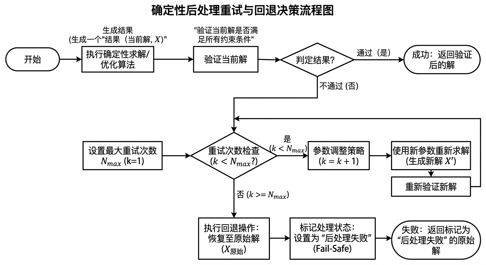

## 交底书名称

一种面向长尾布料蒙皮结果的确定性后处理方法、系统及存储介质（平滑-映射-回写闭环）

---

## 缩略语和关键术语定义

- **长尾布料（Long-tail Cloth）**：生产中出现频率低但修复成本高的布料蒙皮异常场景（如裙摆扭曲、细条塌陷），因量少处理难而得名。
- **后处理（Post-processing）**：初始蒙皮结果生成后、正式发布前，对异常区域执行的自动修正流程。
- **异常区域（Anomalous Region）**：经指标检测（共线、穿插、粘连、曲率突变等）判定为形态退化的局部网格区域。
- **期望几何（Target Geometry）**：通过几何平滑目标函数求解得到的理想顶点位置，作为参数回写的中间目标，不直接作为最终输出。
- **回写（Write-back）**：将几何修正量映射为权重增量或骨骼参数增量并写回生产资产的操作。
- **影响域（Influence Region）**：允许被修改的顶点子集和骨骼子集，通过约束将修正范围限定在异常区域及其直接邻域。
- **锚点边界（Anchor Boundary）**：异常区域外缘保持不动的顶点集合，用于保持修复区域与周边正常区域的几何连续性。
- **拉普拉斯平滑（Laplacian Smoothing）**：利用离散拉普拉斯算子 \(L\) 对顶点位置施加均值约束，抑制局部高频噪声的几何平滑方法。
- **确定性（Determinism）**：同一输入和参数配置下，算法输出可复现且数值波动可控，是生产闭环质量稳定性的核心要求。
- **后台算子（Background Operator）**：封装为可在生产管线中静默自动调用的处理单元，支持批处理与调度触发。
- **闭环验证（Closed-loop Verification）**：回写后自动重新计算质量指标确认修复效果，未达标则执行退化重试或回退。
- **曲率约束（Curvature Constraint）**：通过控制离散曲率变化量，抑制折痕、翻折等形变异常的几何约束项。

---

## 1、*本发明的技术关键点（欲保护点）

本发明面向三维角色动画生产中长尾布料蒙皮异常的修复问题，提出"异常定位触发 → 期望几何生成 → 局部受限回写 → 确定性验证回退"的完整后处理技术方案。核心在于将几何修正目标的生成与参数回写的约束明确解耦，通过确定性执行规则和影响域控制实现可控、可复现、可自验证的局部修复。

本发明欲保护的六个核心技术关键点：

**关键点一：异常触发与区域提取机制**
从外部指标（共线、穿插、粘连、曲率突变等异常检测模块的输出）定位初始异常点集，结合拓扑连通域扩张和边界裁剪，得到精确控制的修复域 \(\Omega\) 及锚点边界集合 \(\partial\Omega\)。

**关键点二：期望几何生成机制**
在修复域 \(\Omega\) 内构建包含拉普拉斯平滑项、曲率约束项、边界锚定项和体积保持项的复合平滑目标函数，求解得到稳定的期望顶点位置 \(\mathbf{y}\)。期望几何作为中间目标显式输出，与参数回写步骤解耦，几何修正目标质量可独立验证。

**关键点三：局部映射回写机制**
在局部影响域内，将几何修正量 \(\Delta\mathbf{x} = \mathbf{y} - \mathbf{x}\) 通过线性映射 \(\mathbf{M}_\Omega\) 映射为权重增量或骨骼参数增量 \(\Delta\boldsymbol{\theta}\)，同时施加影响域约束、幅度上限约束、边界不动约束和合法性约束。本发明不限定映射求解所用的具体求解器类型。

**关键点四：确定性执行机制**
规定固定执行顺序：先求期望几何，再做参数映射，再统一执行幅度投影与合法性修正，最后做边界连续性校正。全程不引入随机采样或概率性中间步骤，保证同输入同参数下输出精确复现。

**关键点五：闭环验证与回退机制**
回写后自动计算共线、穿插、曲率能量、边界连续性等指标下降率；满足阈值则通过；否则执行有限次退化重试（逐步降低平滑强度或缩小影响域）；超过最大重试次数后自动回退原始结果并推送人工复核。

**关键点六：后台算子化与无侵入集成机制**
将上述流程封装为可批处理的后台算子，支持按布料类型模板化参数配置、审计日志记录（规则版本、参数版本、指标前后值）和无侵入式接入（不改变上游模型结构，作为独立后处理步骤插入生产链路）。

本发明的保护边界：核心在于"异常区域触发 + 期望几何生成 + 局部受限回写 + 确定性验证回退"的完整闭环流程，不涵盖通用的稀疏雅可比反向求解器（可作为可选映射实现调用），也不涵盖训练数据闭环系统，与上下游模块形成明确互补关系。

---

## 2、*与本发明最相近的现有技术

与本发明最接近的现有技术包括：人工局部平滑修形、离线物理仿真重烘焙和单次参数优化修权方案。上述方案在特定场景下可实现部分修复，但在可控性、确定性和闭环验证方面存在明显不足。

### 2.1 现有技术的技术方案

**方案一：人工修形方案**
动画师在DCC工具中手动对布料曲线做平滑处理或刷权重，依赖操作者经验，耗时高、吞吐量低，不同操作者结果一致性差，难以复现。

**方案二：全局重绑定方案**
对整个布料区域重新优化权重或驱动参数，容易影响本已正常的区域，产生全局串扰，计算代价高于局部修复实际需求。

**方案三：物理仿真替代方案**
由物理仿真引擎重新计算布料，外观自然但算力成本高、与现有骨骼绑定资产对齐复杂，不适用于需快速修复和回归验证的生产节奏。

**方案四：单指标触发方案**
仅依据单一阈值触发修正，漏检多指标复合异常，对正常区域存在误触发风险，缺乏综合判断能力。

**方案五：无回归闭环方案**
修正完成后缺少统一指标复核机制，无法保证修复结果的质量稳定性，难以实现对长尾问题的持续治理。

### 2.2 现有技术缺点及本发明解决的问题

**缺陷一：修复范围不可控**
全局修改方案影响本无需修改的正常区域，引入新问题。本发明通过影响域约束和锚点边界，将修复精确限定在异常区域内。

**缺陷二：结果不稳定、不可复现**
人工操作和全局优化中的随机因素导致同一问题多次处理结果不同。本发明采用确定性规则序列和固定投影优先级，保证同输入同参数输出精确复现。

**缺陷三：几何修复与参数层脱节**
直接修改几何而不回写参数难以发布；直接修改参数而不经几何目标验证容易过修。本发明将"生成期望几何"与"映射回写参数"明确解耦，分步验证。

**缺陷四：缺少闭环验证和回退机制**
修完即结束，无法自动判断修复是否有效。本发明内置指标回归验证和退化重试，失败时自动回退并打标签，主动管控质量风险。

**缺陷五：长尾场景人工成本高**
长尾异常出现频率低但单次排障成本高。本发明将流程算子化，实现自动触发和无人值守批处理，显著降低人工介入频次。

本发明要解决的核心技术问题是：在不改变上游生成框架的前提下，对长尾布料蒙皮异常执行可控、可复现、可自验证的自动后处理，并以后台算子形式无侵入地集成至现有生产链路，实现对低频高成本长尾问题的系统性治理。

---

## 3、*本发明技术方案的详细阐述

本发明包括产品侧算子流程与技术侧数学流程，两者共同构成可实施的确定性后处理闭环。

### 3.1 产品侧

产品侧以"布料稳定化后处理算子"形式部署，支持单资产交互调用和夜间大批量任务两种模式。

**步骤一：读取初始蒙皮结果**
输入顶点序列 \(\mathbf{V}\)、权重矩阵 \(\mathbf{W}\)、骨骼变换 \(\mathbf{B}\)、网格拓扑 \(\mathcal{M}\) 和部件分组信息。

**步骤二：异常触发**
调用规则引擎或读取外部指标结果（可来自上游异常检测模块或独立规则），识别异常顶点集合 \(\mathcal{V}_{init}\) 并标记异常类型。

**步骤三：参数加载**
按布料类型（长裙/披风/丝带）加载参数模板，包括平滑强度 \(\lambda_l\)、曲率约束权重 \(\lambda_c\)、边界锚定权重 \(\lambda_b\)、幅度限制 \(\eta_i\)、最大重试次数 \(N_{\text{retry}}\) 等。

**步骤四：自动后处理流水线执行**
按"区域裁剪 → 期望几何求解 → 参数回写 → 指标复核"的固定顺序执行，详见技术侧。

**步骤五：结果输出**
将修复结果写回新资产层（原资产版本保留供回滚），生成对比报告（指标前后值、影响域大小、耗时、重试次数）。

**步骤六：回退处理**
若连续 \(N_{\text{retry}}\) 次重试后验证指标仍未满足，自动回退至原始结果，打标签并进入人工复核队列。

产品侧支持模板化配置（按角色类型保存参数预设，新角色只需关联模板即可快速启用）、无侵入集成（不改动上游模型结构，支持已有生产链路无缝接入）、审计记录（规则版本、参数版本、指标前后值，支持全链路追溯）和批处理并行（按镜头或资产分片执行，满足夜间大批量任务时延需求）。

### 3.2 技术侧

技术侧分为六个有序步骤：异常区域构建 → 期望几何平滑求解 → 局部映射回写 → 约束投影与确定性执行 → 闭环验证 → 退化重试与回退。

#### 3.2.1 异常区域构建

设网格 \(\mathcal{M}=(\mathcal{V},\mathcal{E},\mathcal{F})\)，异常打分场为 \(A(v) \geq 0\)（由指标系统输出或规则直接计算）。初始异常点集：

$$
\mathcal{V}_a = \{v \in \mathcal{V} \mid A(v) \ge \tau_a\}.
$$

对 \(\mathcal{V}_a\) 执行拓扑连通域扩张：按布料类型和异常强度自适应确定扩张半径 \(r_e\)（以拓扑边距离度量），合并拓扑相连的异常顶点得到修复域 \(\Omega\)；裁剪宽度小于 \(r_{\min}\) 的孤立点集，避免边界不连续性。**此处"合并"仅指将拓扑相连的异常顶点共同标识为属于同一连通域 \(\Omega\)（集合层面的合并），不改变任何顶点的几何位置；顶点位置的修正由 3.2.2 节的期望几何求解负责。**

**扩张半径自适应规则：** \(r_e\) 的计算依据异常强度和布料类型动态确定：\(r_e = r_{\text{base}} + \lceil \bar{A}_{\mathcal{C}} / A_{\text{step}} \rceil\)，其中 \(r_{\text{base}}\) 为基础扩张步数（长裙典型值2，丝带典型值1），\(\bar{A}_{\mathcal{C}}\) 为连通域内异常分数均值，\(A_{\text{step}}\) 为步长控制参数。该规则使严重异常区域获得更大的修复裕度，轻微异常区域维持最小修复范围。

**孤立点裁剪规则：** 若某连通域的顶点数 \(|\mathcal{C}| < n_{\min}\)（典型值3-5个顶点），或其最大拓扑直径 \(\text{diam}(\mathcal{C}) < r_{\min}\)（典型值2步），则判定为孤立噪声点，从修复域中剔除，避免对微小区域的无意义修正。

定义锚点边界集合 \(\partial\Omega\)：修复域边缘外扩 1–2 圈的顶点（参见图2，\(d_{\max}=2\) 时即为外扩 2 圈），在平滑目标中受强锚定约束，保证修复区域与正常区域的几何连续性。**图 2 颜色约定（关键）**：橙色顶点构成的内部区域即"修复域 \(\Omega\)"——也就是本节及 3.2.2 节中需要重新求解期望坐标 \(\mathbf{y}\) 的待修复区域；蓝色顶点构成的外圈即"锚点边界 \(\partial\Omega\)"——这些顶点在平滑求解中保持原始坐标 \(\mathbf{x}_{\partial\Omega}\) 不变（仅作为强锚定约束），不参与几何修正。锚点边界的权重按拓扑距离从内向外线性递增：距修复域边界 \(d\) 步的锚点权重为 \(\lambda_b \cdot (d / d_{\max})\)，其中 \(d_{\max}\) 为最大锚点层数（典型值2，参见图2）；**此处 \(\lambda_b\) 即 3.2.2 节平滑目标函数中边界锚定项的同一权重参数**。

#### 3.2.2 期望几何平滑目标求解

记修复域内顶点原始坐标为 \(\mathbf{x} \in \mathbb{R}^{3N_\Omega}\)，待求期望坐标为 \(\mathbf{y} \in \mathbb{R}^{3N_\Omega}\)。构建平滑目标函数：

$$
\min_{\mathbf{y}} \;
\lambda_l \|L\mathbf{y}\|_2^2
+ \lambda_c \|\kappa(\mathbf{y}) - \kappa^\star\|_2^2
+ \lambda_b \|\mathbf{y}_{\partial\Omega} - \mathbf{x}_{\partial\Omega}\|_2^2
+ \lambda_v \,\Phi_{\text{vol/len}}(\mathbf{y}, \mathbf{x}),
$$

其中下标 \(\partial\Omega\) 表示"取出向量在锚点边界顶点上的分量"——即 \(\mathbf{y}_{\partial\Omega}\) 仅包含修复域边缘 \(\partial\Omega\) 上顶点的坐标分量（参见图 2 中蓝色边界圈），\(\mathbf{x}_{\partial\Omega}\) 同义。

各项含义：
- **拉普拉斯项**（\(\lambda_l\)）：\(L \in \mathbb{R}^{N_\Omega \times N_\Omega}\) 为修复域上的离散**余切权拉普拉斯算子矩阵**。其作用是：用顶点 \(i\) 的一环邻居 \(\mathcal{N}(i)\) 的位置加权平均去与 \(\mathbf{y}_i\) 比较，最小化所有顶点上的差距即可让 \(\mathbf{y}\) 在局部均值意义下平滑。**该项目标值为零的几何含义是各向同性平滑——令每个顶点尽可能等于其邻居的加权平均，使修复域内的高频抖动被抑制。** 矩阵元素分两类：**对角元 \(L_{ii}\)（行号等于列号的元素）等于该行所有非对角元的负和**（因此每行行和为零，常函数和刚体平移属于零空间，正则项不惩罚整体平移）；**非对角元 \(L_{ij}\)（行号不等于列号的元素）**仅在 \(j\) 是 \(i\) 的一环邻居时非零，定义为
$$
L_{ij} = -\tfrac{1}{2}\bigl(\cot\alpha_{ij} + \cot\beta_{ij}\bigr),\quad j \in \mathcal{N}(i),
$$
其中：\(i, j\) 为修复域 \(\Omega\) 内顶点的全局编号；\(\mathcal{N}(i)\) 是顶点 \(i\) 的一环邻居（与 \(i\) 由一条边直接相连的顶点集合）；\(\alpha_{ij}, \beta_{ij}\) 是边 \((i,j)\) 在两个相邻三角形里所对的两个内角（边界边时只取一个，另一项为 0）。\(L\) 是**稀疏对称半正定矩阵**：所谓"**稀疏**"是描述矩阵的*非零元分布结构*，而不是某个元素的求解公式——具体地，矩阵第 \(i\) 行的非零元个数等于 \(\deg(i)+1\)（其中 \(\deg(i)\) 为顶点 \(i\) 的度数即与之相连的边数；"+1" 来自对角元 \(L_{ii}\) 自身），典型 6–7。**该数式仅用于度量"每行有多少个非零元"，并非用来计算这些元素的值**——非对角元的具体数值由上式 \(L_{ij}=-\tfrac12(\cot\alpha_{ij}+\cot\beta_{ij})\) 给出，对角元的具体数值由 \(L_{ii}=-\sum_{j\in\mathcal{N}(i)}L_{ij}\)（即该行所有非对角元的负和）给出，二者是不同的角色。稀疏结构意味着算子只处理顶点与其直接邻居的关系，不牵涉远距离顶点，计算效率高；半正定性保证后续构建的能量函数为凸函数，求解过程具有良好的收敛性与解的存在唯一性（在锚定项使其非奇异的前提下）。\(\|L\mathbf{y}\|_2^2\) 度量整个修复域内所有顶点偏离邻域均值的总能量。相较均匀权拉普拉斯（\(L_{ij}^{\text{uni}} = -1/\deg(i)\)），余切权对长瘦三角形更稳健，避免平滑过程将不同形状的三角形拉向同一面积水平。典型 \(\lambda_l \in [0.1, 1.0]\)。
- **曲率约束项**（\(\lambda_c\)）：\(\kappa^\star\) 为平滑参考曲率，取为绑定姿态下的离散平均曲率或修复域边界处曲率的线性插值，约束曲率变化量不超出预期范围。**仅靠拉普拉斯平滑（目标为零）会让修复域趋于平面或球面，从而抹除布料应有的形状特征（如裙摆褶皱、披风弧度）；曲率参考项以周边完好区域的曲率为锚，告诉优化器"在这个位置应有多大的弯曲"，从而保留自然的几何特征。** 该项防止平滑过程产生过于"平坦"的结果，保持布料应有的自然弯曲特征。典型 \(\lambda_c \in [0.05, 0.5]\)。
- **边界锚定项**（\(\lambda_b \gg \lambda_l\)）：强制锚点边界顶点不远离原始位置 \(\mathbf{x}_{\partial\Omega}\)，保证修复域与正常区域之间的几何连续性。通常 \(\lambda_b = 10\lambda_l \sim 100\lambda_l\)，确保边界处修正量趋近于零。
- **体积/边长保持项**（\(\lambda_v\)）：软约束保持局部体积或特征边长，防止布料过度收缩。**纯几何平滑可能导致修复域局部塌陷（体积变小）或膨胀（边长拉长），该项以原始几何度量为非零目标，"锁住"几何尺度，使修复后局部形态保持自然。** 体积保持项定义为 \(\Phi_{\text{vol}} = \sum_{f \in \mathcal{F}_\Omega} (V_f(\mathbf{y}) - V_f(\mathbf{x}))^2\)，其中求和遍历集合 \(\mathcal{F}_\Omega\)——即修复域 \(\Omega\) 内**所有顶点所在的三角形面片**（具体取法：对每个顶点 \(i\in\Omega\) 收集其所在的全部面片，再去重得到 \(\mathcal{F}_\Omega\)），\(V_f\) 为单个面片 \(f\) 的面积（二维情况下，由该三角形三个顶点坐标按海伦公式或叉积模长计算）或四面体体积（三维情况）；\(V_f(\mathbf{y})\) 与 \(V_f(\mathbf{x})\) 分别表示用待求坐标 \(\mathbf{y}\) 与原始坐标 \(\mathbf{x}\) 计算同一面片得到的两个度量值。边长保持项定义为 \(\Phi_{\text{len}} = \sum_{(i,j) \in \mathcal{E}_\Omega} (\|\mathbf{y}_i - \mathbf{y}_j\| - \|\mathbf{x}_i - \mathbf{x}_j\|)^2\)，其中 \(\mathcal{E}_\Omega\) 为修复域内所有边的集合。典型 \(\lambda_v \in [0.01, 0.2]\)。

**位移幅度约束：**
$$
\|\mathbf{y} - \mathbf{x}\|_\infty \le \Delta_{\max}, \quad \mathbf{y}_{\partial\Omega} \approx \mathbf{x}_{\partial\Omega}.
$$

上述目标函数转化为带约束的稀疏线性最小二乘问题；本发明并不在此构造新的求解算法，而是采用业内成熟的两条求解路径——**直接法（稀疏 Cholesky 分解）** 和 **迭代法（预条件共轭梯度，PCG）**——视修复域规模和复用条件择一执行（详见 (a)、(b) 两小节）。由于拉普拉斯项 \(\|L\mathbf{y}\|_2^2\)、曲率项 \(\|\kappa(\mathbf{y})-\kappa^\star\|_2^2\)、边界锚定项 \(\|\mathbf{y}_{\partial\Omega}-\mathbf{x}_{\partial\Omega}\|_2^2\) 和体积/边长保持项的线性化形式都可写成 \(\|\mathbf{A}_k\mathbf{y}-\mathbf{b}_k\|_2^2\) 的形式（\(k\) 标记不同正则项），将各项按权重 \(\sqrt{\lambda_k}\) 行堆叠后即得统一的最小二乘问题
$$
\min_{\mathbf{y}}\;\|\mathbf{A}\mathbf{y}-\mathbf{b}\|_2^2,
\qquad
\mathbf{A}=\begin{bmatrix}\sqrt{\lambda_l}\,L\\ \sqrt{\lambda_c}\,J_\kappa\\ \sqrt{\lambda_b}\,S_{\partial\Omega}\\ \sqrt{\lambda_v}\,J_v\end{bmatrix},
\quad
\mathbf{b}=\begin{bmatrix}\mathbf{0}\\ \sqrt{\lambda_c}\,\kappa^\star\\ \sqrt{\lambda_b}\,\mathbf{x}_{\partial\Omega}\\ \sqrt{\lambda_v}\,\mathbf{b}_v\end{bmatrix},
$$
其中：\(\mathbf{A}\in\mathbb{R}^{M\times 3N_\Omega}\) 为将所有正则项的系数矩阵竖向堆叠得到的统一系统矩阵，行数 \(M\) 等于全部约束方程总数；\(\mathbf{b}\in\mathbb{R}^{M}\) 为对应目标值向量。

**各项目标值的几何含义：**
- 拉普拉斯项目标为 \(\mathbf{0}\)：在各向同性平滑（isotropic smoothing）意义下，希望每个顶点尽可能等于其邻居的加权平均，即"局部均值"约束；
- 边界锚定项目标为 \(\mathbf{x}_{\partial\Omega}\)：边界顶点必须锚定在原始坐标 \(\mathbf{x}\) 上，以保持修复域与正常区域的几何连续性；
- 曲率参考项目标为 \(\kappa^\star\)（非零）：仅靠拉普拉斯平滑会让修复域抹平所有形状特征（裙摆褶皱、披风弧度等），曲率参考项以周边完好曲率为锚，告诉优化器"在这个位置应有多少弯曲"；
- 体积/边长保持项目标为 \(\mathbf{b}_v\)（非零）：纯平滑可能导致局部塌陷或膨胀，该项以原始几何尺度（面积、体积或边长）作为非零目标"锁住"几何度量。

**各子矩阵含义：** \(L\) 为前述余切权拉普拉斯算子；\(J_\kappa\) 为曲率算子在当前点的离散雅可比矩阵——即将"计算当前顶点曲率"这一非线性过程在当前点 \(\mathbf{y}\) 处做一阶线性化（求一阶偏导）所得的局部系数矩阵，使曲率约束项可以纳入线性最小二乘框架；\(S_{\partial\Omega}\) 为从修复域全顶点向锚点边界顶点的选取矩阵（每行恰好一个 1）；\(J_v\) 为体积或边长保持项的线性化雅可比矩阵；\(\sqrt{\lambda_k}\) 对每一行块统一乘以权重的平方根，使最终残差平方和恰好等于原加权目标函数。

由于 \(\mathbf{A}\) 是稀疏矩阵（每行只有少量非零元，对应该约束直接涉及的几个顶点），其非零元总数与修复域大小 \(N_\Omega\) 线性相关，而稀疏率（零元占比）随 \(N_\Omega\) 增大而趋近 1。求最小二乘的常用做法是解**法方程**
$$
(\mathbf{A}^T\mathbf{A})\,\mathbf{y}=\mathbf{A}^T\mathbf{b},
$$
其中 \(\mathbf{A}^T\mathbf{A}\in\mathbb{R}^{3N_\Omega\times 3N_\Omega}\) 是对称半正定的稀疏方阵，\(\mathbf{A}^T\mathbf{b}\in\mathbb{R}^{3N_\Omega}\) 为对应的右端项。本发明针对该方程提供两种可选求解路径（均属现有成熟数值方法，不限定具体实现库）：

**（a）直接法——稀疏 Cholesky 分解。** 因 \(\mathbf{A}^T\mathbf{A}\) 对称半正定且边界锚定项使其非奇异（\(\lambda_b>0\) 等价于将零空间约束去除），故可对其执行稀疏 Cholesky 分解 \(\mathbf{A}^T\mathbf{A}=\mathbf{R}^T\mathbf{R}\)（\(\mathbf{R}\) 为上三角因子），通过两次三角回代即可解出 \(\mathbf{y}\)。该路径适用于 \(N_\Omega<5000\) 的中等规模修复域；当**网格拓扑（顶点连接关系）和正则项权重均不变时**，因子 \(\mathbf{R}\) 可缓存重用——同类布料、同一异常模式的批量任务因此只在第一次付出分解代价（\(O(N_\Omega^{1.5})\) 量级），后续每帧仅需 \(O(\mathrm{nnz}(\mathbf{R}))\) 的回代开销。

**（b）迭代法——预条件共轭梯度（PCG）。** 当 \(N_\Omega>5000\) 或修复域形状每帧变化导致分解无法复用时，转用 PCG 迭代求解 \((\mathbf{A}^T\mathbf{A})\mathbf{y}=\mathbf{A}^T\mathbf{b}\)：每次迭代仅需一次稀疏矩阵—向量乘 \(\mathbf{A}^T\mathbf{A}\mathbf{v}\)，避免显式分解。直接 CG 的收敛速度取决于 \(\mathbf{A}^T\mathbf{A}\) 的条件数 \(\kappa(\mathbf{A}^T\mathbf{A})\)，而拉普拉斯算子在网格细化或边长悬殊时极易病态，因此本发明采用**不完全 Cholesky 分解（IC(0)）**作为预条件子 \(\mathbf{P}\approx\mathbf{A}^T\mathbf{A}\)：保留与 \(\mathbf{A}^T\mathbf{A}\) 相同稀疏模式、忽略填充元的近似 Cholesky 因子，将每次迭代等价的方程改写为 \(\mathbf{P}^{-1}(\mathbf{A}^T\mathbf{A})\mathbf{y}=\mathbf{P}^{-1}\mathbf{A}^T\mathbf{b}\)，使有效条件数显著下降。在典型修复域上，PCG 收敛到相对残差 \(10^{-6}\) 通常需 50–200 步，整体复杂度 \(O(N_\Omega K_\Omega)\)（\(K_\Omega\) 为迭代步数）。

该步骤输出"期望几何 \(\mathbf{y}\)"而非直接修改参数，为后续回写提供可独立验证的几何目标。

#### 3.2.3 局部映射回写

令几何修正量 \(\Delta\mathbf{x} = \mathbf{y} - \mathbf{x}\)。在局部影响域 \(\Omega\) 内，设参数增量为 \(\Delta\boldsymbol{\theta}\)（权重增量 \(\Delta\mathbf{w}\) 或骨骼局部参数增量），建立线性映射关系：

$$
\Delta\mathbf{x}_\Omega \approx \mathbf{M}_\Omega \, \Delta\boldsymbol{\theta},
$$

其中映射矩阵 \(\mathbf{M}_\Omega\) 由影响域内LBS偏导项构成（本发明不限定具体求解器）。回写优化目标：

$$
\min_{\Delta\boldsymbol{\theta}} \;
\|\mathbf{M}_\Omega \Delta\boldsymbol{\theta} - \Delta\mathbf{x}_\Omega\|_2^2
+ \lambda_r \|\Delta\boldsymbol{\theta}\|_2^2,
$$

并施加以下四类约束：
1. **影响域约束**：仅允许局部骨骼子集 \(\mathcal{B}_\Omega\) 对应的参数变化；
2. **幅度约束**：\(|\Delta\theta_i| \le \eta_i\)，防止单骨骼或权重变化过大引入全局影响；
3. **边界保持约束**：**锚点边界顶点 \(\partial\Omega\)（即图 2 中蓝色顶点圈）**及其位于修复域内侧的近边界邻域顶点（距 \(\partial\Omega\) 拓扑距离 \(d_i \le d_{\max}\) 的修复域内部顶点）的参数变化幅度按距离边界的拓扑步数单调衰减——拓扑距离越近 \(\partial\Omega\) 的顶点，参数变化幅度越被压缩，从而保证修复域与正常区域之间不会在边界处产生参数突变；衰减规则的具体形式见 §3.2.4 的边界连续性投影 \(\Pi_{\text{边}}\)；
4. **合法性约束**（权重层）：\(w_{ik} + \Delta w_{ik} \ge 0\)，\(\sum_{k \in \mathcal{B}_i}(w_{ik} + \Delta w_{ik}) = 1\)（其中 \(\mathcal{B}_i\) 为顶点 \(i\) 关联的骨骼集合）。

求解策略与 3.2.2 节同构：将主目标项及前三类线性约束（影响域、幅度、边界保持）一并写为 \(\|\mathbf{A}'\Delta\boldsymbol{\theta}-\mathbf{b}'\|_2^2\) 的稀疏线性最小二乘形式（同样不限定具体求解器，直接法或 PCG 均可），第 4 类合法性约束因含归一化等非线性等式约束，统一交由 3.2.4 节的"约束投影"步骤后处理执行。

#### 3.2.4 约束投影与确定性执行

**投影算子的定义。** 设 \(\mathcal{C} \subseteq \mathbb{R}^{P}\) 为参数空间中由 3.2.3 节四类约束共同定义的**可行域**——即所有同时满足这四类约束条件的参数取值组成的集合（\(P\) 为参数总维度）。可行域由"约束的描述（不等式/等式形式）"和"对应输入"共同确定，本发明所需的输入包括：影响域骨骼/顶点索引集合 \(\mathcal{I}_\Omega, \mathcal{B}_\Omega\)、各分量幅度上限 \(\{\eta_i\}\)、初始参数 \(\boldsymbol{\theta}_0\)、最大锚点层数 \(d_{\max}\) 与每个顶点到 \(\partial\Omega\) 的拓扑距离 \(\{d_i\}\)、（权重层时）每顶点关联的骨骼集合 \(\{\mathcal{B}_i\}\)。给定这些输入后，可行域分量分解为
$$
\mathcal{C} = \mathcal{C}_{\text{域}} \cap \mathcal{C}_{\text{幅}} \cap \mathcal{C}_{\text{合}} \cap \mathcal{C}_{\text{边}},
$$
分别对应 3.2.3 节的影响域约束、幅度约束、权重合法性约束、边界保持约束。**投影算子** \(\Pi_\mathcal{C}: \mathbb{R}^{P} \to \mathcal{C}\) 的几何含义是"在可行域 \(\mathcal{C}\) 内寻找与当前点 \(\boldsymbol{\theta}'\) 距离最近的合法点"，即
$$
\Pi_\mathcal{C}(\boldsymbol{\theta}') = \arg\min_{\boldsymbol{\theta} \in \mathcal{C}} \|\boldsymbol{\theta} - \boldsymbol{\theta}'\|_2^2.
$$
直观上：上一步线性映射回写出的 \(\boldsymbol{\theta}' = \boldsymbol{\theta}_0 + \Delta\boldsymbol{\theta}\) 可能违反某些约束（例如权重出现负值、单骨骼变化幅度超过预设 \(\eta_i\) 等），投影算子把它"拉"到最近的合法配置上。

**复合投影的分解。** 由于 \(\mathcal{C}\) 是四个简单凸集的交集，整体投影 \(\Pi_\mathcal{C}\) 难以一步闭式求得，本发明采用**串行投影**实现：依次对每一个分量约束做单独投影，并固定顺序为
$$
\Pi_\mathcal{C} \;\triangleq\; \Pi_{\text{边}} \circ \Pi_{\text{合}} \circ \Pi_{\text{幅}} \circ \Pi_{\text{域}},
$$
其中 \(\circ\) 表示函数复合（先做最右边的 \(\Pi_{\text{域}}\)，最后做 \(\Pi_{\text{边}}\)）。各分量投影的显式表达式如下。

**1. 影响域投影 \(\Pi_{\text{域}}\)：** 将影响域外的参数分量强制保持原值——直观语义即"回写后的蒙皮权重对应顶点若不属于允许变化的局部骨骼子集 \(\mathcal{I}_\Omega\)，则还原为初始值 \(\theta_{0,i}\)"。允许变化的局部骨骼子集示例：（i）若长裙下摆出现扭曲，\(\mathcal{B}_\Omega\) 可取 {下摆所属裙摆骨骼、相邻 1–2 根支撑骨骼}；（ii）若披风袖口附近出现穿插，\(\mathcal{B}_\Omega\) 可取 {袖口骨骼、肩关节骨骼}；其余骨骼（如躯干、腿部）的权重不允许被修改。
$$
[\Pi_{\text{域}}(\boldsymbol{\theta}')]_i =
\begin{cases}
\theta'_i, & i \in \mathcal{I}_\Omega, \\
\theta_{0,i}, & i \notin \mathcal{I}_\Omega,
\end{cases}
$$
其中 \(\mathcal{I}_\Omega\) 是影响域骨骼/顶点对应的参数索引集合，\(\theta_{0,i}\) 是该参数的初始值。该投影确保只有局部参数被修改。

**2. 幅度投影 \(\Pi_{\text{幅}}\)：** 对每个分量独立做截断（clip）
$$
[\Pi_{\text{幅}}(\boldsymbol{\theta})]_i = \theta_{0,i} + \mathrm{clip}\bigl(\theta_i - \theta_{0,i},\; -\eta_i,\; \eta_i\bigr),
$$
其中 \(\mathrm{clip}(x, a, b) = \min(\max(x, a), b)\)。即把每个参数相对初值的偏移幅度截断到 \([-\eta_i, \eta_i]\) 区间内。

**3. 合法性投影 \(\Pi_{\text{合}}\)（仅权重层）：** 先做非负截断，再按顶点逐一归一化
$$
\tilde w_{ik} = \max(w_{ik}, 0),\qquad
[\Pi_{\text{合}}(\mathbf{w})]_{ik} = \frac{\tilde w_{ik}}{\sum_{k' \in \mathcal{B}_i} \tilde w_{ik'} + \varepsilon},
$$
其中 \(\varepsilon\) 为防零项（典型 \(10^{-12}\)），\(\mathcal{B}_i\) 为顶点 \(i\) 关联的骨骼集合。该投影保证每个顶点的所有骨骼权重 \(\ge 0\) 且和为 1。

**4. 边界连续性投影 \(\Pi_{\text{边}}\)：** 对距修复域边界 \(\partial\Omega\)（即图 2 中蓝色锚点边界顶点圈）拓扑距离为 \(d_i\) 的顶点参数做线性衰减
$$
[\Pi_{\text{边}}(\boldsymbol{\theta})]_i = \theta_{0,i} + \mu(d_i)\,(\theta_i - \theta_{0,i}),\qquad
\mu(d) = \min\!\left(1,\; \frac{d}{d_{\max}}\right),
$$
其中 \(d_i\) 是参数 \(i\)（即参数向量 \(\boldsymbol{\theta}\) 的第 \(i\) 个分量，对应到具体某个顶点—骨骼对的权重或某个骨骼的某一维变换分量；该参数所"关联"的顶点即承载它的网格顶点）所关联顶点到锚点边界 \(\partial\Omega\) 的**拓扑层数**——亦即"该顶点经多少跳一环邻居才能首次触达 \(\partial\Omega\) 中某顶点"，与几何欧氏距离无关。**举例**：若一顶点本身就在 \(\partial\Omega\)（即蓝色顶点）则 \(d_i=0\)；若它是 \(\partial\Omega\) 的一环邻居（即与锚点边界顶点直接由一条边相连）则 \(d_i=1\)；二环邻居 \(d_i=2\)；以此类推。修复域内部 \(d_i \ge d_{\max}\) 时 \(\mu = 1\) 即不衰减；\(d_{\max}\) 是衰减层数（典型 2，即 \(d_i=0,1,2\) 三层做衰减、再深的内部顶点保持原样）。这一步消除修复域与正常区域在边界处的参数突变。

**为什么必须固定顺序。** 上述四个投影**互不可交换**——例如先做"幅度截断"再做"权重归一化"，归一化会改变各分量比例从而再次违反幅度约束；反之先归一化再截断，截断后行和不再为 1。本发明明确规定顺序为 \(\Pi_{\text{域}} \to \Pi_{\text{幅}} \to \Pi_{\text{合}} \to \Pi_{\text{边}}\)，依据是：影响域约束最刚性（外部参数永不改），幅度约束次之，权重合法性是必要后处理，边界连续性作为最末步对邻域过渡做软化。固定顺序、固定每一步的算子定义，是同输入同参数下结果可精确复现的核心保证。

#### 3.2.5 闭环验证

回写完成后，在修复域及其邻域上重新计算以下四类验证指标：
1. **共线异常下降率** \(R_{\text{col}} = 1 - S_{\text{col}}^{\text{new}} / S_{\text{col}}^{\text{old}}\)；
2. **穿插/粘连指标下降率** \(R_{\text{int}} = 1 - S_{\text{int}}^{\text{new}} / S_{\text{int}}^{\text{old}}\)；
3. **曲率高频能量下降率** \(R_{\text{curv}} = 1 - E_\kappa^{\text{new}} / E_\kappa^{\text{old}}\)；
4. **边界连续性指标** \(C_{\text{bdry}}\)（回写后边界附近速度与法线连续性得分）。

通过验证条件：
$$
R_{\text{col}} \ge \rho_1, \quad R_{\text{int}} \ge \rho_2, \quad R_{\text{curv}} \ge \rho_3, \quad C_{\text{bdry}} \ge \rho_4.
$$

所有条件满足则写入新资产版本并标记为"后处理通过"；否则进入退化重试。

#### 3.2.6 退化重试与回退

当验证不通过时，执行有限次退化重试：

**第1次重试：降低平滑强度。** 将 \(\lambda_l\) 和 \(\lambda_c\) 分别乘以衰减因子 \(\gamma_\lambda = 0.5\)（即减半），减少过度平滑导致的边界不连续或自然外观丧失。其余参数不变。

**第2次重试：进一步降低平滑强度并微调体积保持。** 在第1次基础上继续将 \(\lambda_l\) 衰减（总计为原始值的25%），同时将体积保持权重 \(\lambda_v\) 提升至原始值的1.5倍，防止因平滑不足导致的体积塌陷。

**第3次重试：缩小影响域。** 将影响域半径 \(r_e\) 缩减为原始值的50%（\(r_e \leftarrow \lceil r_e/2 \rceil\)），重新构建更小的修复域和锚点边界，以更保守的范围执行修复，防止过修。

超过 \(N_{\text{retry}}\)（默认3）次后自动回退至原始结果，打标签"后处理失败"并推送至人工复核队列。每次重试独立执行完整的"期望几何求解 → 回写 → 验证"流程，保证每次重试的确定性。

局部闭环在修复域局部子空间完成，规模约为 \(O(N_\Omega^2)\)（直接法）至 \(O(N_\Omega K_\Omega)\)（迭代法，\(K_\Omega\) 为迭代步数），相较全局重算具有显著的时间和内存优势；不同异常区域可分块并行处理，同类布料可复用矩阵分解结果（Cholesky因子缓存）。典型修复域 \(N_\Omega = 50\sim500\) 个顶点时，单次平滑求解耗时在毫秒级别。

---

## 4、*技术方案所产生的有益效果

**效果一：生产确定性大幅提升**
同配置可精确复现，避免同镜头多次运行结果不一致，使后处理模块成为可信任的生产工具。

**效果二：人工返修频次显著降低**
自动处理裙摆扭曲、细条塌陷等长尾异常，仅将验证失败的真正疑难样本推送人工复核，降低人工介入频次。

**效果三：修复范围局部可控**
影响域约束和锚点边界保持保证修复精确限定在异常区域，不对邻近正常区域产生串扰，减少"修好一个问题引入另一个问题"的情形。

**效果四：发布质量稳定性提升**
内置闭环验证和退化重试机制，主动拦截"修复后仍不合格"的结果，降低异常漏出至下游的风险。

**效果五：无侵入接入，存量管线兼容**
以后处理步骤形式无侵入接入现有生产链路，不要求替换上游蒙皮生成模型，存量资产和流程均可直接使用。

**效果六：持续优化支撑**
模板化参数管理和审计日志支持后续策略迭代，参数版本化保证历史结果可追溯。

可量化示例：裙摆扭曲和局部抖动类异常在后处理后，共线/曲率能量指标下降率可达设定阈值；人工修复工时减少，批量任务通过率显著提升；关键质量指标（共线、穿插、曲率能量）在回归集上持续改善；失败样本比例降低，发布前返工次数下降，整体研发效率得到明显改观。

上述效果来自"定位—平滑—回写—验证"四步闭环协同，而非单一几何平滑算子的孤立贡献。

---

## 5、发散思维，针对3中的技术方案，是否还有其他别的替代方案

在不改变本发明核心思想（异常定位触发 + 期望几何生成 + 局部受限回写 + 确定性验证回退）的前提下，可采用以下替代实施路径：

**替代方案一：异常触发替代**
异常区域识别可由固定阈值规则、统计分位数阈值或学习型评分器触发，前提是输出一致的异常点集 \(\mathcal{V}_a\)，不影响后续流程。

**替代方案二：平滑目标函数替代**
拉普拉斯平滑可替换为双边平滑（保留锐利边界）、曲率流（基于平均曲率的演化方程）或ARAP（As-Rigid-As-Possible）模型，以适配不同布料类型对自然外观的具体要求。

**替代方案三：回写层替代**
参数回写目标可优先选择权重层（适合蒙皮权重明显偏差），或优先选择骨骼局部旋转/缩放参数层（适合骨骼驱动问题），也可采用权重层与骨骼参数层联合回写策略。

**替代方案四：约束求解替代**
映射回写中的约束优化可采用罚函数法、主动集法、增广拉格朗日法（ADMM）等求解策略，只要保证同输入同参数下输出数值一致性，均属本发明实施范围。

**替代方案五：验证指标替代**
验证阶段的四类指标可替换为体积保持指标（防止布料过度收缩）、帧间速度平滑指标（防止修复引入速度突变）或部位专属外观质量指标，以适配不同生产场景的验收标准。

**替代方案六：执行模式替代**
后处理算子可在线交互模式（动画师实时预览修复效果并决定是否接受）或完全离线批处理模式执行；失败处理可接入"人工标注引导修复"或"规则自动重配置"流程。

本发明的保护重点在于：异常区域触发与精确划定机制、期望几何生成与参数回写的解耦设计、确定性执行顺序的规定，以及内置验证回退的闭环自检机制。

---

## 附件参考文献（如：专利/论文/网页/期刊）

[1] Sorkine, O. (2005). Laplacian Mesh Processing. Eurographics 2005 State of the Art Report. https://doi.org/10.2312/egst.20051044

[2] Sorkine, O., & Alexa, M. (2007). As-Rigid-As-Possible Surface Modeling. Eurographics Symposium on Geometry Processing (SGP 2007). https://doi.org/10.2312/SGP/SGP07/109-116

[3] Botsch, M., Kobbelt, L., Pauly, M., Alliez, P., & Lévy, B. (2010). Polygon Mesh Processing. CRC Press. https://www.pmp-book.org/

[4] Nealen, A., Müller, M., Keiser, R., Boxerman, E., & Carlson, M. (2006). Physically Based Deformable Models in Computer Graphics. Computer Graphics Forum, 25(4). https://doi.org/10.1111/j.1467-8659.2006.01000.x

[5] Bridson, R., & Fedkiw, R. (2002). Robust Treatment of Collisions, Contact and Friction for Cloth Animation. ACM TOG (SIGGRAPH 2002). https://dl.acm.org/doi/10.1145/566654.566623

[6] Blender Manual — Cloth Simulation and Corrective Smooth Modifier. https://docs.blender.org/manual/en/latest/physics/cloth/

[7] Open3D Documentation — Mesh Smoothing and Geometry Processing APIs. https://www.open3d.org/docs/release/
